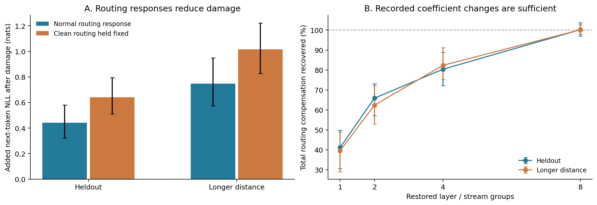
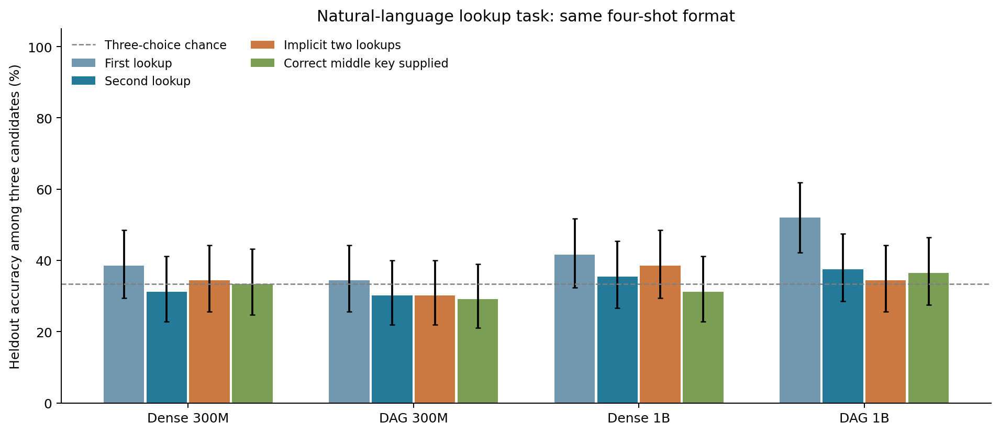

# 损伤补偿、规则切换与组合回路实验

2026-09-29。本轮三个方向均已执行。**稳定的阳性结果是损伤后的路由补偿；
尚未找到可选择性移植的语义操作或可组合的语义回路。** 全部模型权重冻结，
没有更新 backbone、predictor、local correction，也没有重新预训练。

## 1. 读取路径受损后，local correction 确实减轻损伤

在 300M DAG 中删除之前定位的主要读取 head L6/H11（零基编号），比较
正常 forward 与固定受损前有效路由。这里固定的是每个输入、所有位置的
`predictor + correction` 输出，不是仅冻结网络参数。

| 新样本条件 | 原模型准确率 | 删除主 head，正常路由 | 删除主 head，固定原路由 | 正常路由减少的 NLL 损伤 |
|---|---:|---:|---:|---:|
| Heldout，period64 | 98.44% | 93.75% | 89.06% | 0.199 nats |
| 更远距离，period128 | 93.75% | 82.81% | 77.34% | 0.268 nats |

每种条件有 64 个独立内容对。正常与固定路由的差来自 local correction 对
受损 hidden states 的响应：global predictor 只读取同一批 input IDs，
看不到内部 head 损伤，输出不会因此变化。

另找到 L7/H1 的早层来源读取：来源为 embedding、layer0 与 layer1。
这些来源的投影内容在 A 损伤前后逐元素不变，但切断这些读取造成的额外
NLL 损伤在 A 已损伤时更大，条件交互分别为 **0.419 [0.349, 0.493]**、
**0.519 [0.402, 0.649]**。改问另一个未干预的位置时，交互接近零。

这个结果支持保存完好的早层内容在损伤后仍承担读取功能。Dense 也有备用
head 的条件交互；early/recent 读取的编辑范数约差 27 倍，所以不能把它
解释成 DAG 独有冗余，或同等强度损伤下早层来源的普遍优势。这轮也没有
恢复训练，尚未直接解释 finetune 后的 pruning robustness。

[完整损伤实验](damage_mechanism/README.md)保留新样本确认、之前样本的
探索、随机对照、编辑幅度和逐例数值。

## 2. 补偿可进一步定位到少数路由组

在另一批独立样本上，把受损模型的所有路由固定为原值，再逐组重放该输入
正常受损 forward 中产生的系数变化。内容始终由当前模型重新计算，不移植
别的输入的答案或内容。

Discovery 选出的前两组是 **L7/Q、L8/R**。每组包括该层该 stream 的全部
head/source 系数和全部 token；两组不等于两条边。

| 重放的路由组数 | Heldout 补偿收益恢复比例 | 更远距离 |
|---|---:|---:|
| 1 | 41.2% | 39.6% |
| 2 | **65.9% [57.2, 73.1]** | **62.4% [52.8, 72.2]** |
| 4 | 80.4% | 82.3% |
| 8 | 100.2% | 100.1% |

分母是“正常路由响应相对固定路由减少的 NLL 损伤”，不是完整模型能力。
两组重放优于三个保留层分布的随机组，并且对受损模型的帮助大于对未受损
模型的帮助。完整受损系数重放逐 logit 复现正常受损结果，误差为零。

这证明记录下来的部分系数变化足以解释大部分补偿收益；不证明只保留这些
组的在线反馈就是必要且最小的完整机制。

左图来自损伤确认集，右图来自独立的系数重放确认集。误差线为配对样本
bootstrap 95% 区间。[系数重放明细](route_repair/README.md)。

## 3. 路由系数没有选择性地搬运查询规则

先筛查表转换、显式链、索引等任务的多个示例提示。300M 和 1B 都没有
两个转换规则同时通过完整词表准确率门槛，因此不能在这些提示上判断算法
切换的机制。随后使用已经掌握的复制任务，改变查询的是哪一个历史位置。

接收者输入和内容计算保持不变，只移植 donor 的 predictor、correction
或两者。跨内容 donor 使用不同答案词表。关键对照保持 donor 内容相同，
只改变它查询的位置，检验正确查询 donor 是否比错误查询 donor 更有效。

| 模型 / 条件 | 原任务准确率 | 正确查询 donor − 错误查询 donor 的目标 margin 差 |
|---|---:|---:|
| 300M heldout | 97.66% | −0.215 [−0.602, 0.133] |
| 300M 更远距离 | 95.31% | −0.304 [−0.727, 0.080] |
| 1B heldout | 99.22% | +0.082 [−0.282, 0.446] |
| 1B 更远距离 | 100.00% | +0.060 [−0.297, 0.419] |

表中为 query 位置范围、两类系数同时移植；其他通道、范围和对照全部保留。
两个尺寸在 heldout 的同内容正确查询移植都没有成功换成目标答案。1B 的
正反方向系数差都可提高某些相对分数，方向却没有可靠区别，不能当作操作
切换成功。这里测试的是复制地址选择，不能直接推广到所有语义规则。

[300M 完整结果](rule_switch/README.md)、[1B 完整结果](rule_switch/1b/README.md)。
初次 300M 随机 donor 对照复用了相邻组内容，后已独立补跑；主对照不受
影响，修正前数值仅保留在审计文件中。

## 4. 两步组合：能力不足，构造性拼接也未通过键选择验证

任务是先查名字对应的编号，再查编号对应的颜色。四个 checkpoint 都未在
本轮提示中稳定掌握隐式两步查找。每模型先在 discovery 上选格式，再测
96 个新随机表；候选内两步准确率为 Dense300M 39.6%、DAG300M 32.3%、
Dense1B 28.1%、DAG1B 26.0%，所有 95% 区间都包含三选一的 33.3%。
统一自然语言 4-shot 的独立补充也没有改变这个判断。

在 DAG1B 的等式格式中，明确给出正确中间键可把准确率从 26.0% 提到
76.0%。因此进一步检验构造性拼接：donor 单独算出键 C，recipient 已有
原键 B；只移植中间层查询 head 输出，看它能否按 C 查自己的表。目标
颜色既不是 recipient 原颜色，也不是 donor 自己表中的颜色。这项实验
检验能否拼接单步计算，不解释原本不存在稳定证据的隐式两步能力。

- **按相对 margin 搜索的第一轮失败。** Heldout 的 top4 让第三颜色准确率
  从 17.2% 变成 0%，却有 71.9% 的样本直接输出 donor 的中间键。相对
  margin 上升没有对应到目标行为成功。
- **改为完整词表目标 logp 搜索后，部分边际分数改善。** 使用新的 discovery
  和 heldout，top2 的第三颜色准确率从 12.5% 到 28.1%；但固定接收者、
  只将 donor 算出的键由 C 改为 D 时，没有可靠的 C/D 颜色选择变化。
  top2 的键特异性配对双差为 −0.0049 [−0.0352, 0.0244] nats。
- **这种改善不能算语义组合。** Top2 的第三颜色 logp 增益约 +0.143，
  由三色总概率质量变化 −0.196 与三色内目标 logp 变化 +0.339 构成。
  原颜色 logp 降低 0.575，无关备选颜色反而提高 0.184，比目标颜色更多。
  它没有展示按 donor 中间键区分两种替代颜色的能力。

改目标函数的第二轮是观察失败后的自适应后续，不能当作初始方案的独立
复制。所有预算、随机集合、原本能做各单步的子集覆盖率，以及同一例子
在 donor 颜色、recipient 表、donor 查询变化后的表现均保留。

[能力筛查](composition/README.md)、[构造性拼接](composition_constructive/README.md)、
[改用 logp 的后续](composition_constructive/logp_objective/README.md)、
[键特异性验证](composition_constructive/logp_objective/semantic_diagnostics/README.md)。

## 复现与验证

- 损伤与重放：`scripts/circuit_damage_mechanism.py`、
  `scripts/circuit_route_repair.py`。
- 规则移植：`scripts/circuit_rule_switch.py`。
- 两步能力与拼接：`scripts/circuit_composition.py`、
  `scripts/circuit_composition_constructive.py`。
- 汇总图：`scripts/plot_circuit_followup.py`。

300M 使用 step9000 的 dense 与 FourWay + local correction；1B 使用
完成训练的 step38160 checkpoint。1B 的训练语料和 V norm 与 300M 不同，
这里将它用于能力扩展，不作纯尺寸效应推断。每个实验文件保留实际配置、
选择过程、原始逐例数值及样本不确定性；没有训练 seed 复制。

所有恒等干预、head hook 与同一输出投影路径的 parity 检查通过。1B 拼接
中，全序列与仅末 token 的 BF16 输出投影有单例最大 0.0625 的舍入差，
所有对比都用同一末 token 投影。键特异性对照扣除了对应 baseline 双差，
避免不同分桶形状下的细微数值变化被当作 donor 键效应。

实验启动时记录的 git commit 是代码基线；本轮新脚本与结果在同一交付
提交中提供。没有 merge 同事的 PR。
