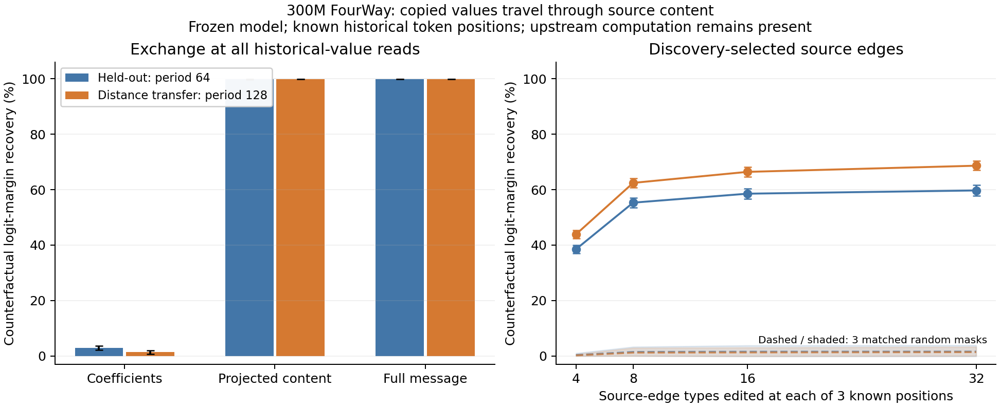
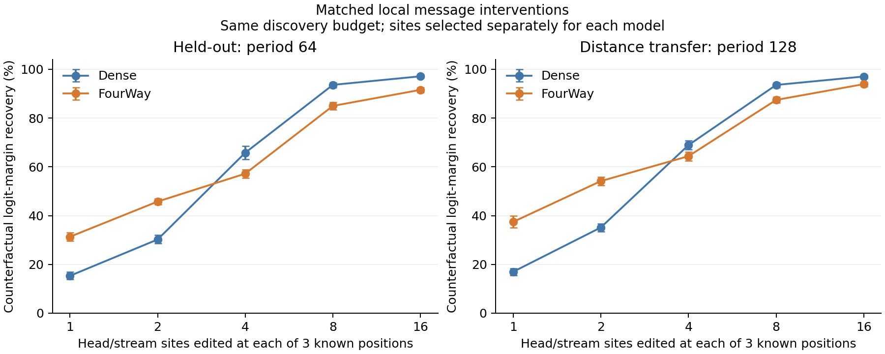

# 冻结模型的回路定位与解释性对比

2026-09-28，300M dense 与 FourWay + local correction，匹配 step9000
checkpoint。本轮全部完成，模型权重保持冻结。结果支持可迁移、具有目标
选择性的复制内容读取路径；目前没有得到跨预算一致的 DAG 解释性优势。
最值得进一步验证的信号是：在共同粒度下，只干预最重要的1–2个消息点时，
DAG 的反事实效果更强。

## 1. 定位到的原生来源路径

任务由三个完整随机token块和一个相同的未完成前缀组成。成对输入只改变
前文三个位置上的值，最后查询前缀完全相同。干预发生在这三个已知历史
位置，未直接编辑查询位置或最终输出。

32对discovery输入选定路径，随后在64对新输入及64对更远距离输入上测试；
每对双向交换。边的位置由任务构造提供，搜索只选择layer/head/source，
因此这是已知位置上的因果定位。



交换所有相关读取的有效系数（predictor + correction），heldout答案margin
恢复约2.86%；交换投影后的来源内容恢复99.81%；交换完整消息恢复99.86%。
这些效果不能相加解释为信息量占比，稳定路由仍可能是完成复制的必要结构。

按discovery排序的前8条来源边都是 V 路径，连接embedding及前两层状态到
L6/L7的四个head（层与head编号从0开始）。8种边分别在3处历史位置干预，
共24个时空消息实例；上游计算仍全部存在。

| 固定top8完整消息干预 | Heldout，period64 | 距离迁移，period128 |
|---|---:|---:|
| 反事实答案margin恢复 | 55.32% [53.56, 56.97] | 62.45% [60.74, 64.14] |
| 输出donor答案的全词表准确率 | 64.06% | 82.81% |
| 三个匹配随机集合的最大margin恢复 | 3.32% | 2.92% |

改问同一上下文中另一个未变化的位置，top8干预后准确率仍为98.44%，
正确答案logp变化约−0.000067 nats，区间包含零。这支持两个复制目标之间
的选择性，不等于已证明一般自然文本能力不受损。

完整阶梯、系数/内容/消息分解、固定有效路由对照与随机比较见
[原生消息报告](message_patching/README.md)。此部分只研究DAG内部机制。

## 2. 同样的消息干预粒度，与dense比较

两模型使用同一批输入，单位统一为 `(layer, Q/K/V stream, head)` 的64维
向量，每个点都编辑3个历史位置。搜索预算相同：36个layer-stream扫描，
再在各自discovery最有效的4组中扫描64个head；固定top1/2/4/8/16后测试。
这是同预算分层搜索，尚未证明找到了全局最小集合。



表中为反事实答案margin恢复比例：

| 干预点数 | Heldout dense | Heldout DAG | 距离迁移 dense | 距离迁移 DAG |
|---|---:|---:|---:|---:|
| 1 | 15.3% | 31.3% | 17.0% | 37.4% |
| 2 | 30.2% | 45.7% | 35.1% | 54.1% |
| 4 | 65.8% | 57.2% | 68.9% | 64.4% |
| 8 | 93.6% | 85.0% | 93.5% | 87.4% |
| 16 | 97.1% | 91.5% | 97.0% | 93.9% |

top2的DAG优势为heldout +15.55个百分点 [13.48,17.50]、迁移
+19.01 [16.93,21.06]。但top8的顺序反过来，DAG分别低8.63和6.14个
百分点。仅在两个模型都答对的配对子集上比较，结论同向。

DAG的前两个点为L6/V/h11、L7/V/h1，支持少数局部读取点较强的信号；
两模型的干预范数并未匹配，所以不能据此声称同干预强度下的普遍优势。
所有top-k对未变化查询均不改变准确率（dense96.88%，DAG98.44%）。

计数相同不等于完整回路大小相同；完整模型的其他计算始终运行。
[共同消息报告](common_message_patching/README.md)保留每个预算、随机集合
实际重叠、编辑范数、共同成功子集及配对区间。

## 3. 稀疏backbone head集合没有呈现稳定优势

对两模型分别学习精确保留64/96/128/160个head输出的二值mask，目标是复制
完整模型的输出分布。所有模型参数冻结，只有mask分数优化；每个预算独立
学习并按validation KL选择，MLP、predictor、correction始终运行。


在96-head预算固定数据、只改变mask初始化和minibatch顺序复验两次后，
远距复制的DAG−dense相对准确率损失差为−2.08、+2.63、−4.51个百分点，
方向随mask优化seed翻转。自然WikiText的损伤三次都是DAG较大：

| 96个head保留 | 三个mask seed的平均ΔNLL | seed范围 |
|---|---:|---:|
| Dense | 0.4615 | 0.3655–0.5180 |
| DAG | 0.8175 | 0.7389–0.9524 |

自然文本只测24个512-token窗口、每窗64个输出位置，不能把它换算成完整
WikiText PPL。160-head预算的初次结果中DAG损伤较小，64-head远距复制则
更差，完整曲线交叉，不能挑一个预算概括整架构。

用固定position-mean global routing重新评估同一DAG mask，结果变化较小。
这项对照移除了外部predictor输出的输入依赖，local correction仍正常响应。
[完整对比](head_support/summary.md)、[三个mask seed复验](head_support/mask_seed_replication.md)。

## 可用结论与下一步

可用的机制案例是：少数V读取路径能选择性改变模型从历史中复制的值，
而且固定选择能跨复制距离迁移。共同粒度下，DAG在极少干预点时效果较强，
但曲线随后被dense超过；head集合实验也没有发现稳定的整体优势。

本轮是合成复制任务上的实验，尚未恢复之前失败的自然语言实体—颜色绑定
机制，也没有做新的输入soft-prefix优化。更有针对性的后续是假设这些
从早层读取内容的路径与损伤后的功能保留有关，再用剪枝前后配对干预验证。

## 复现与验证

代码与结果在同一提交中提供；运行时记录的git commit是当时的仓库基线，
这些新脚本在首次运行时尚未提交。模型来自
`checkpoints/pr_sync_20260917/{300m-baseline,300m-dagformer}`。

```bash
python scripts/circuit_head_support.py --kind baseline --out experiments/results/circuit_interpretability_20260928/head_support/baseline.json
python scripts/circuit_head_support.py --kind dagformer --out experiments/results/circuit_interpretability_20260928/head_support/dagformer.json
# 96-head重复：两模型各加 --budgets 96 --controls 0 --mask-seed 20261001（及20261002），使用不同out文件
python scripts/circuit_message_patching.py --seed 20260930 --discovery-pairs 32
python scripts/circuit_common_message_patching.py
python scripts/summarize_circuit_head_support.py
python scripts/plot_circuit_message_patching.py
```

完整logits与只计算评测位置的输出projection逐元素一致；全1 head mask、
同输入消息移植均逐元素复现原输出。两个模型的head-mask多seed复验完整
输出一致；实际搜索、heldout结果和配对bootstrap均保存。检查记录在
head_support的projection_check文件及message结果中的identity/parity记录。

所有GPU实验已结束。开发smoke和重复worker文件保留本地，发布的文件
只包含最终实验与数值验证。
