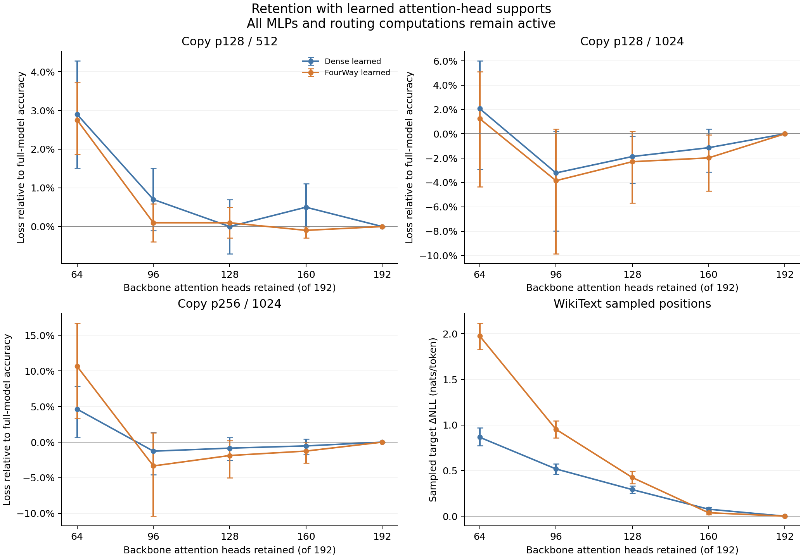

# Frozen attention-head supports

Both model runs are complete. Masks retain 64, 96, 128 or 160 of 192 backbone attention-head outputs; each budget has its own optimization and validation selection. Model weights are frozen. All MLPs, predictor and correction computations remain active, so these counts describe attention-head support, not complete circuit size.

The [control comparison figure](head_support.png) also includes the random masks. Error bars bootstrap matched evaluation sequences/windows. Control bands span three per-layer-count-matched random masks; they are not optimization-seed confidence intervals. The natural-text endpoint scores 64 positions in each of 24 WikiText windows of length 512.

## Full-model references

| Dataset | Dense accuracy | DAG accuracy | Dense NLL | DAG NLL |
|---|---:|---:|---:|---:|
| Copy p128 / 512 | 97.66% | 99.32% | 0.3612 | 0.1701 |
| Copy p128 / 1024 | 94.24% | 93.85% | 0.5120 | 0.4711 |
| Copy p256 / 1024 | 92.68% | 93.55% | 0.7188 | 0.5991 |
| WikiText sampled positions | 33.85% | 35.61% | 3.9717 | 3.8179 |

## Retention on new synthetic sequences

Normalized accuracy loss is `(full accuracy − masked accuracy) / full accuracy`, reported as percent of each model's full accuracy. Bootstrap draws recompute both numerator and denominator. Negative DAG-minus-dense contrasts favor DAG retention; these are fixed-checkpoint, single-mask-optimization-seed comparisons. Intervals are unadjusted for multiple comparisons.

| Dataset | Heads kept | Dense loss, % | DAG loss, % | DAG − dense, 95% CI |
|---|---:|---:|---:|---:|
| Copy p128 / 512 | 64 | 2.90 | 2.75 | -0.15 [-1.63, 1.33] |
| Copy p128 / 512 | 96 | 0.70 | 0.10 | -0.60 [-1.60, 0.40] |
| Copy p128 / 512 | 128 | 0.00 | 0.10 | 0.10 [-0.89, 1.09] |
| Copy p128 / 512 | 160 | 0.50 | -0.10 | -0.60 [-1.20, 0.00] |
| Copy p128 / 1024 | 64 | 2.07 | 1.25 | -0.82 [-3.45, 1.70] |
| Copy p128 / 1024 | 96 | -3.21 | -3.85 | -0.64 [-3.21, 1.24] |
| Copy p128 / 1024 | 128 | -1.87 | -2.29 | -0.42 [-2.43, 1.24] |
| Copy p128 / 1024 | 160 | -1.14 | -1.98 | -0.84 [-2.06, 0.20] |
| Copy p256 / 1024 | 64 | 4.64 | 10.65 | 6.01 [0.63, 11.11] |
| Copy p256 / 1024 | 96 | -1.26 | -3.34 | -2.08 [-6.44, 1.08] |
| Copy p256 / 1024 | 128 | -0.84 | -1.88 | -1.04 [-3.33, 0.82] |
| Copy p256 / 1024 | 160 | -0.53 | -1.25 | -0.73 [-2.16, 0.45] |

## Natural-text capability cost

NLL increments use each model's own full-model reference and matched windows.

| Heads kept | Dense ΔNLL | DAG ΔNLL | DAG − dense damage, 95% CI |
|---|---:|---:|---:|
| 64 | 0.8657 | 1.9761 | 1.1104 [0.9909, 1.2321] |
| 96 | 0.5180 | 0.9524 | 0.4344 [0.3502, 0.5143] |
| 128 | 0.2916 | 0.4242 | 0.1326 [0.0645, 0.2049] |
| 160 | 0.0765 | 0.0378 | -0.0387 [-0.0700, -0.0071] |

## Teacher distribution retention

KL is measured against each model's own unmasked dynamic teacher. Its cross-model difference compares drift from different distributions; it is not a comparison against one shared teacher.

| Dataset | Heads kept | Dense KL | DAG KL | DAG − dense KL, 95% CI |
|---|---:|---:|---:|---:|
| Copy p128 / 512 | 64 | 0.3328 | 0.2208 | -0.1119 [-0.1557, -0.0661] |
| Copy p128 / 512 | 96 | 0.1187 | 0.1142 | -0.0044 [-0.0264, 0.0160] |
| Copy p128 / 512 | 128 | 0.0771 | 0.0418 | -0.0353 [-0.0458, -0.0241] |
| Copy p128 / 512 | 160 | 0.0334 | 0.0113 | -0.0221 [-0.0273, -0.0172] |
| Copy p128 / 1024 | 64 | 0.5962 | 0.4007 | -0.1955 [-0.2652, -0.1263] |
| Copy p128 / 1024 | 96 | 0.2490 | 0.2647 | 0.0157 [-0.0398, 0.0885] |
| Copy p128 / 1024 | 128 | 0.1132 | 0.0812 | -0.0321 [-0.0606, 0.0042] |
| Copy p128 / 1024 | 160 | 0.0453 | 0.0260 | -0.0192 [-0.0260, -0.0117] |
| Copy p256 / 1024 | 64 | 0.5838 | 0.8574 | 0.2736 [0.0786, 0.5019] |
| Copy p256 / 1024 | 96 | 0.2867 | 0.3285 | 0.0418 [-0.0444, 0.1529] |
| Copy p256 / 1024 | 128 | 0.1685 | 0.1011 | -0.0675 [-0.0956, -0.0331] |
| Copy p256 / 1024 | 160 | 0.0619 | 0.0269 | -0.0351 [-0.0464, -0.0252] |
| WikiText sampled positions | 64 | 0.8653 | 1.9928 | 1.1275 [0.9965, 1.2502] |
| WikiText sampled positions | 96 | 0.5159 | 1.0298 | 0.5138 [0.4519, 0.5798] |
| WikiText sampled positions | 128 | 0.3273 | 0.5265 | 0.1992 [0.1661, 0.2341] |
| WikiText sampled positions | 160 | 0.0859 | 0.0570 | -0.0289 [-0.0413, -0.0186] |

## Learned versus random retained supports

Synthetic entries are normalized accuracy loss (%); WikiText entries are ΔNLL. Random ranges are the minimum and maximum means of the three layer-matched masks. All individual learned-minus-random paired contrasts are preserved in summary.json.

| Dataset | Heads kept | Dense learned / random range | DAG learned / random range |
|---|---:|---:|---:|
| Copy p128 / 512 | 64 | 2.90 / [65.50, 95.70] | 2.75 / [73.75, 87.71] |
| Copy p128 / 512 | 96 | 0.70 / [78.90, 98.30] | 0.10 / [95.58, 96.26] |
| Copy p128 / 512 | 128 | 0.00 / [4.10, 39.40] | 0.10 / [2.06, 97.74] |
| Copy p128 / 512 | 160 | 0.50 / [15.70, 40.80] | -0.10 / [0.88, 2.36] |
| Copy p128 / 1024 | 64 | 2.07 / [66.74, 95.54] | 1.25 / [72.74, 86.26] |
| Copy p128 / 1024 | 96 | -3.21 / [75.65, 98.24] | -3.85 / [95.01, 96.77] |
| Copy p128 / 1024 | 128 | -1.87 / [2.49, 37.10] | -2.29 / [-1.35, 97.92] |
| Copy p128 / 1024 | 160 | -1.14 / [24.35, 42.80] | -1.98 / [-3.75, 3.95] |
| Copy p256 / 1024 | 64 | 4.64 / [76.92, 98.42] | 10.65 / [76.10, 89.77] |
| Copy p256 / 1024 | 96 | -1.26 / [82.09, 98.42] | -3.34 / [95.41, 97.39] |
| Copy p256 / 1024 | 128 | -0.84 / [6.85, 61.01] | -1.88 / [4.80, 97.49] |
| Copy p256 / 1024 | 160 | -0.53 / [40.57, 54.27] | -1.25 / [0.52, 7.10] |
| WikiText sampled positions | 64 | 0.8657 / [2.4190, 3.6254] | 1.9761 / [1.6623, 3.0625] |
| WikiText sampled positions | 96 | 0.5180 / [1.1989, 2.8078] | 0.9524 / [1.3570, 1.8413] |
| WikiText sampled positions | 128 | 0.2916 / [0.3163, 0.7841] | 0.4242 / [0.6036, 1.1100] |
| WikiText sampled positions | 160 | 0.0765 / [0.2498, 0.3982] | 0.0378 / [0.0859, 0.2690] |

## Removing the learned support

Synthetic entries are normalized accuracy loss (%); WikiText entries are ΔNLL. Random ranges are the minimum and maximum means of the three layer-matched masks. All individual learned-minus-random paired contrasts are preserved in summary.json.

| Dataset | Heads removed | Dense learned / random range | DAG learned / random range |
|---|---:|---:|---:|
| Copy p128 / 512 | 64 | 99.50 / [57.30, 97.10] | 98.82 / [67.26, 97.25] |
| Copy p128 / 512 | 96 | 97.40 / [97.10, 99.40] | 99.21 / [37.17, 98.82] |
| Copy p128 / 512 | 128 | 99.00 / [98.40, 99.10] | 98.62 / [95.18, 99.71] |
| Copy p128 / 512 | 160 | 99.40 / [99.40, 99.90] | 98.82 / [98.43, 99.41] |
| Copy p128 / 1024 | 64 | 99.27 / [52.12, 97.10] | 98.96 / [77.42, 97.29] |
| Copy p128 / 1024 | 96 | 98.65 / [97.82, 99.38] | 98.13 / [46.41, 99.27] |
| Copy p128 / 1024 | 128 | 99.17 / [98.76, 99.27] | 98.02 / [96.67, 99.58] |
| Copy p128 / 1024 | 160 | 99.69 / [99.59, 99.79] | 99.69 / [98.86, 99.58] |
| Copy p256 / 1024 | 64 | 99.16 / [70.60, 97.05] | 98.33 / [81.94, 96.24] |
| Copy p256 / 1024 | 96 | 98.00 / [97.05, 99.26] | 98.54 / [64.09, 98.75] |
| Copy p256 / 1024 | 128 | 99.37 / [98.63, 99.16] | 98.33 / [96.35, 99.90] |
| Copy p256 / 1024 | 160 | 99.58 / [98.95, 99.58] | 99.16 / [97.81, 99.69] |
| WikiText sampled positions | 64 | 4.4518 / [1.3017, 2.6415] | 4.7079 / [1.2930, 2.3997] |
| WikiText sampled positions | 96 | 4.8808 / [3.3927, 4.9823] | 5.9856 / [1.8330, 5.4317] |
| WikiText sampled positions | 128 | 5.1319 / [3.4976, 5.2240] | 4.7911 / [3.2378, 4.9094] |
| WikiText sampled positions | 160 | 5.1421 / [4.9732, 5.3380] | 6.1370 / [5.1554, 5.4617] |

## Fixed predictor position-table diagnostic

Only the external predictor is replaced by position means from separate discovery-copy sequences; local correction remains active. The learned masks are unchanged. All fixed-mask damage below is relative to **fixed_routes_full**, not dynamic full.

| Dataset | Fixed full − dynamic full accuracy, pp | Fixed full − dynamic full NLL | KL to dynamic teacher |
|---|---:|---:|---:|
| Copy p128 / 512 | -0.10 [-0.29, 0.00] | 0.0032 [0.0014, 0.0052] | 0.0004 |
| Copy p128 / 1024 | 0.68 [0.00, 1.76] | -0.0256 [-0.0586, 0.0014] | 0.0014 |
| Copy p256 / 1024 | 0.59 [-0.20, 1.56] | -0.0175 [-0.0524, 0.0063] | 0.0014 |
| WikiText sampled positions | -0.20 [-0.65, 0.26] | 0.0008 [-0.0012, 0.0030] | 0.0006 |

Synthetic damage is normalized accuracy loss (%); WikiText damage is ΔNLL. The last column is a paired contrast of damage, using the correct full reference for each routing condition.

| Dataset | Heads kept | Dynamic damage | Fixed-route damage | Fixed − dynamic damage, 95% CI |
|---|---:|---:|---:|---:|
| Copy p128 / 512 | 64 | 2.75 | 2.85 | 0.10 [-0.19, 0.40] |
| Copy p128 / 512 | 96 | 0.10 | 0.00 | -0.10 [-0.30, 0.00] |
| Copy p128 / 512 | 128 | 0.10 | -0.10 | -0.20 [-0.59, 0.00] |
| Copy p128 / 512 | 160 | -0.10 | -0.20 | -0.10 [-0.30, 0.00] |
| Copy p128 / 1024 | 64 | 1.25 | 1.45 | 0.20 [-0.40, 0.96] |
| Copy p128 / 1024 | 96 | -3.85 | -3.41 | 0.44 [0.00, 1.37] |
| Copy p128 / 1024 | 128 | -2.29 | -2.17 | 0.12 [-0.20, 0.54] |
| Copy p128 / 1024 | 160 | -1.98 | -2.27 | -0.30 [-1.03, 0.24] |
| Copy p256 / 1024 | 64 | 10.65 | 10.68 | 0.04 [-0.93, 1.12] |
| Copy p256 / 1024 | 96 | -3.34 | -2.59 | 0.75 [-0.10, 2.02] |
| Copy p256 / 1024 | 128 | -1.88 | -1.45 | 0.43 [-0.10, 1.11] |
| Copy p256 / 1024 | 160 | -1.25 | -1.14 | 0.11 [-0.41, 0.67] |
| WikiText sampled positions | 64 | 1.9761 | 1.9934 | 0.0174 [0.0055, 0.0310] |
| WikiText sampled positions | 96 | 0.9524 | 0.9589 | 0.0064 [0.0030, 0.0100] |
| WikiText sampled positions | 128 | 0.4242 | 0.4235 | -0.0007 [-0.0030, 0.0016] |
| WikiText sampled positions | 160 | 0.0378 | 0.0387 | 0.0009 [-0.0008, 0.0024] |

The fixed-route KL cache still uses the dynamic full teacher. JSON therefore reports fixed-mask KL increments over fixed full as `KL(dynamic teacher || fixed masked) − KL(dynamic teacher || fixed full)`; this is not `KL(fixed full || fixed masked)`.

## Reproduction

`python scripts/summarize_circuit_head_support.py --input-dir experiments/results/circuit_interpretability_20260928/head_support`

Sources: [dense](baseline.json), [DAG](dagformer.json). [All paired statistics](summary.json); [learned-support vector figure](head_support_learned.pdf); [control vector figure](head_support.pdf). The [96-head mask-seed follow-up](mask_seed_replication.md) reports the original seed and two additional optimization seeds on the same data.
