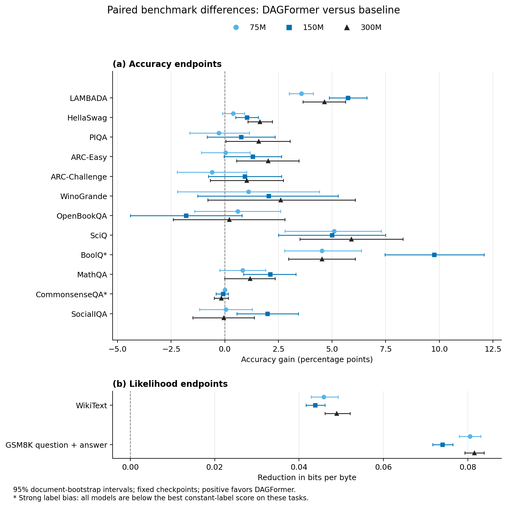
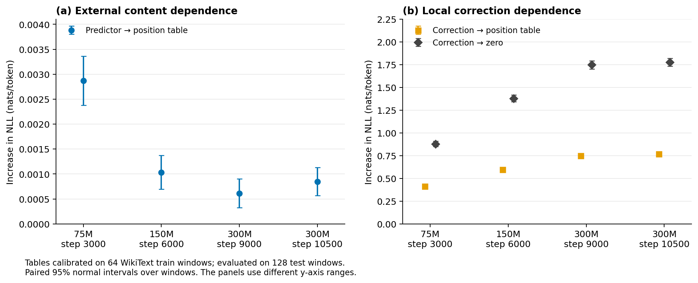
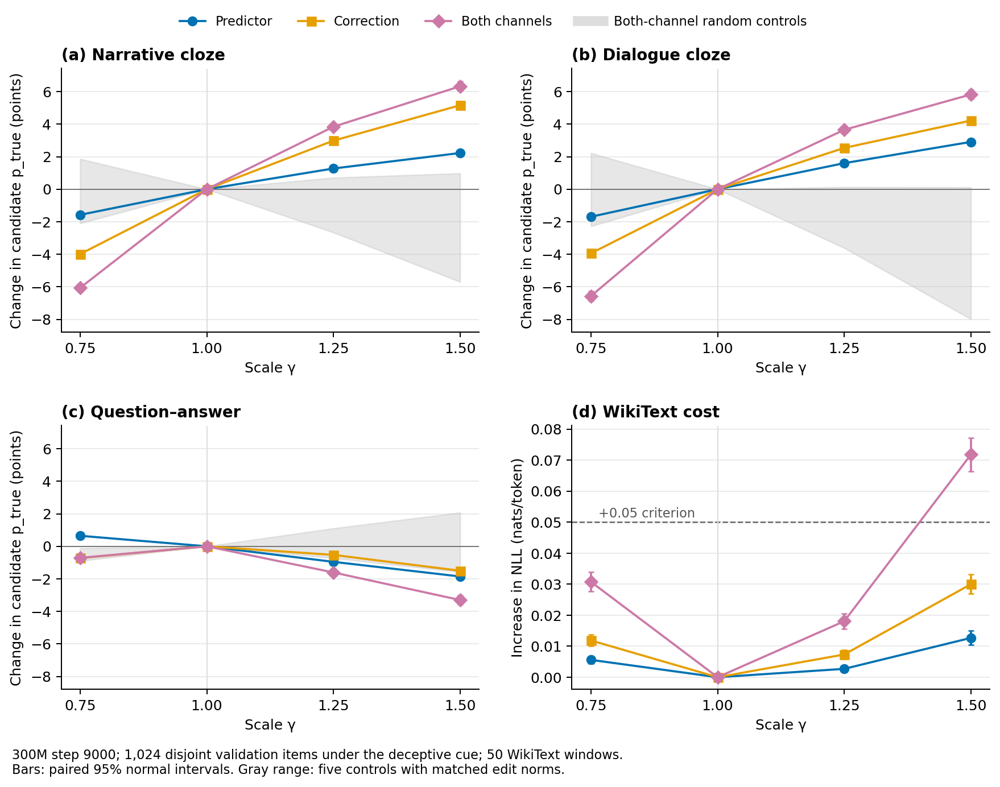

# DAGFormer evaluation campaign — September 17, 2026

This campaign compares fixed checkpoints on ordinary language-model tasks and
tests what the external predictor and local corrections contribute. The
[code/PR audit](../../PROJECT_SYNC_2026-09-17.md) records recovered Delta work,
the merged PRs and corrections to their interpretations.

## Ordinary evaluation

The full 14-task likelihood suite is complete for the 75M, 150M and 300M
baseline/DAGFormer pairs. The 600M baseline is an unpaired reference. The 300M
pair uses **step 9000 for both models**, resolving PR #1's 9000-versus-12000
training-step mismatch. The nominal sizes refer to backbone scales;
DAGFormer includes additional predictor and correction parameters.

Selected 300M results, with paired document-bootstrap intervals:

| Task / metric | Baseline | DAGFormer | Difference favoring DAGFormer | 95% interval |
|---|---:|---:|---:|---|
| WikiText / bits per byte | 1.0714 | 1.0225 | 0.0489 | [0.0461, 0.0521] |
| LAMBADA / accuracy | 25.54% | 30.18% | 4.64 percentage points | [3.65, 5.63] |
| HellaSwag / normalized accuracy | 29.81% | 31.45% | 1.63 percentage points | [1.08, 2.21] |
| SciQ / accuracy | 63.90% | 69.80% | 5.90 percentage points | [3.50, 8.30] |
| BoolQ / accuracy | 56.27% | 60.80% | 4.53 percentage points | [2.97, 6.09] |

[All paired results](standard_matched/paired_summary.md) include losses and
uncertain differences. Intervals describe document sampling for these trained
checkpoints, without multiple-testing adjustment or training-seed uncertainty.
GSM8K BPB scores the question and gold answer jointly; generated-answer
accuracy is being evaluated separately on the full 1,319-item test split.

The [explicit-label audit](standard_matched/label_bias.md) shows two limitations:
all models choose A on at least 98.94% of standard CommonsenseQA questions,
and every BoolQ score remains below the 62.17% constant-yes baseline. The
relative BoolQ gain above therefore does not establish successful reading
comprehension. A separately named, answer-text CommonsenseQA control is queued;
it will not replace the upstream task's results.

All 14 endpoints at all three matched backbone scales. Positive values favor
DAGFormer; intervals are paired document-bootstrap 95% intervals. The
asterisked tasks have strong label biases, described above.

## Routing dependence

Position means were calibrated on 64 WikiText training windows, then evaluated
on 128 disjoint test windows, each 1024 tokens. The table replaces the external
predictor's content-dependent output; the trained model's weights are fixed.

| Checkpoint | Original NLL | Replace predictor with position table: ΔNLL | Disable corrections: ΔNLL |
|---|---:|---:|---:|
| 75M, step 3000 | 4.76458 | +0.00287 | +0.88061 |
| 150M, step 6000 | 4.08631 | +0.00103 | +1.38065 |
| 300M, step 9000 | 3.61780 | +0.00061 | +1.74929 |
| 300M, step 10500 | 3.60116 | +0.00085 | +1.77919 |

The external predictor's input-dependent component has a small marginal effect
in this test. Removing its learned wiring entirely is a different intervention
and causes substantial damage. Freezing the local corrections also hurts
performance. These inference edits do not establish what a retrained model
needs; the separately trained 150M ablation ladder is queued for evaluation.

The [routing results](routing_dependence/300m.json) retain all per-sequence
losses, intervals, constant/global and cross-sequence substitutions, plus
synthetic repetition tests at periods 64, 128 and 256.

Tables use 64 WikiText training windows and evaluation uses 128 test windows.
Intervals are paired normal intervals across windows. The two panels use
different vertical ranges to show the small external-predictor effect and
the larger correction effects. Substitution hooks still execute the original
predictor before replacing its output; these runs measure dependence, not
an inference-speed improvement.

## Direct head edits and the PR #2 contrast

The fixed ten-edge circuit selected in the author's earlier experiment was
tested on 1,024 new content combinations, excluding all 240 discovery items.
At gamma 1.5, predictor-only edits raise candidate-normalized context fidelity
by 2.10 percentage points under the deceptive cue, with +0.00613 natural-text
NLL; correction-only edits raise it by 4.77 points, with +0.01519 NLL.
The same directions also affect neutral prompts. This is evidence about
context retrieval, not intent to deceive.

The original gamma 4 edit raises NLL by +1.05066 when applied to both channels,
so its large fidelity gain comes with a substantial language-model cost.
[The full dose table](context_fidelity/context_fidelity_full.md) records this
alongside random-head controls.

A second set of 1,024 content combinations excludes both the 240 original
discovery items and the first 1,024 evaluation items. The same second set was
tested in three prompt formats, with five random-head controls whose edit
norms match the circuit per layer and token. Language-model cost now uses 50
WikiText validation windows. At gamma 1.25, the both-channel edit changes
candidate-normalized fidelity under the deceptive cue by **+3.84 points in
the narrative format, +3.65 in dialogue, and -1.61 in question–answer format**.
Its WikiText NLL cost is +0.01806. At gamma 1.5 the narrative gain is +6.33
points, but the NLL cost rises to +0.07179, exceeding the project's +0.05
criterion. The original natural-text cache had understated this cost.

The gray range shows five norm-matched random-head controls for both-channel
edits; it is not a confidence interval. Colored intervals are paired normal
intervals across the 1,024 content combinations or 50 language-model windows.
The QA reversal limits the claim to the measured prompt formats. An
unconstrained generation evaluation on a third disjoint item set is queued to
test whether the candidate-based result transfers to generated answers.

The [seven hyperconnection edges](context_fidelity/context_validation_hyper.md)
and [three sequential-path edges](context_fidelity/context_validation_sequential.md)
each contribute: at gamma 1.25, both-channel edits give +2.26 and +1.80 points
respectively in the narrative/deceptive condition. These effects need not add
linearly. The unchanged ten-edge selection also transfers to the
[step-10500 checkpoint](context_fidelity/context_validation_step10500.md), with
+3.79 points and +0.02037 WikiText NLL at gamma 1.25. These are content-item
and nearby-checkpoint replications, not evidence of a general honesty circuit.

PR #2's domain-code experiment was rerun with the same 50 natural-text windows
used for the first context-fidelity test and a denser small-dose grid. The
[predictor](domain_code/verify_domain_code_pred.md) and
[correction](domain_code/verify_domain_code_corr.md) discovery directions still
do not give a supported useful steering result under the +0.05-NLL criterion.
The default eight null draws select 1,598 correction edges; reproducing the
PR's six-draw setting selects 813 (original: 829). The selection count is
sensitive to this Monte Carlo setting even though the measured channel-level
instruction effect is nearly unchanged.

## Reproduction and artifacts

- Evaluation environment: `lm_eval==0.4.13`, Transformers 4.57.1, PyTorch
  2.10.0+cu128; timan1 GPUs 2 and 3.
- Ordinary entry point: `experiments/results/lmeval/run_eval.py`; use
  `--save-samples --save-likelihood-samples` for paired document analysis.
- Context-fidelity entry point: `scripts/eval_context_fidelity.py`.
- Routing-dependence entry point: `scripts/eval_routing_dependence.py`;
  `scripts/prepare_wikitext_eval_cache.py` creates the disjoint split caches.
- JSONs record arguments, checkpoint steps and code versions. The
  [checkpoint manifest](provenance/checkpoint_locations.json) and
  [corpus metadata](provenance/wikitext_cache_metadata.json) identify inputs.
- Per-document benchmark samples and raw context-fidelity arrays remain under
  this directory's ignored `samples/` and `raw/` paths. Compact summaries are
  checked into Git. Logs are under `logs/eval_20260917`.
- The current code mirror on Delta is
  `/work/hdd/bfqt/yurenh2/dagformer-eval-20260917`. The original project under
  `/projects/bfqt/users/yurenh2/ml-projects/DAGFormer` was preserved because its
  filesystem quota is full. Its uncommitted source/results were recovered and
  pushed before running these experiments.
