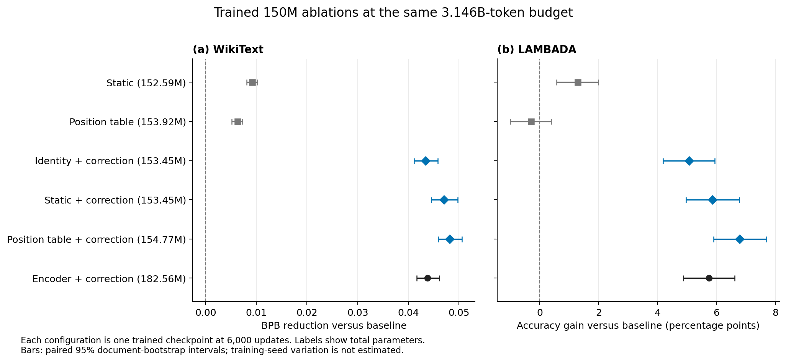
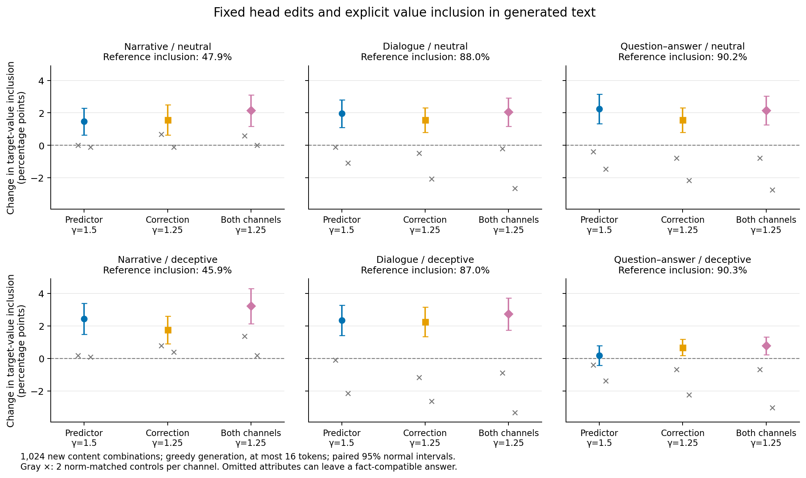
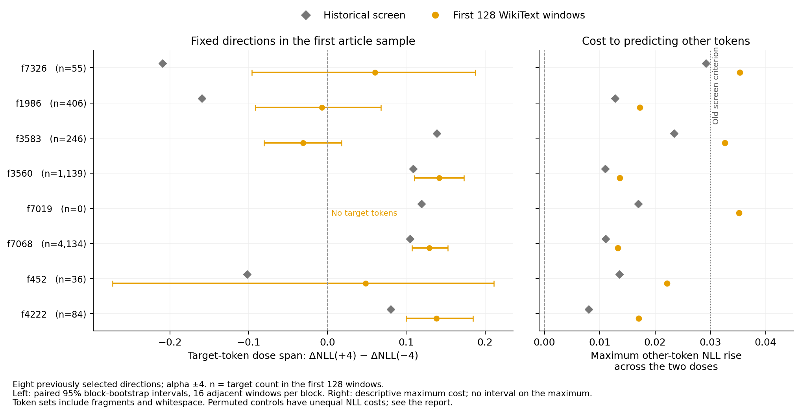

# DAGFormer evaluation campaign — September 17, 2026

This campaign compares fixed checkpoints on ordinary language-model tasks and
tests what the external predictor and local corrections contribute. The
[code/PR audit](../../PROJECT_SYNC_2026-09-17.md) records recovered Delta work,
the merged PRs and corrections to their interpretations.

中文入口：[代码汇总与评估验收说明](验收说明.md)。

## Ordinary evaluation

The full 14-task likelihood suite is complete for the 75M, 150M and 300M
baseline/DAGFormer pairs. The 600M baseline is an unpaired reference. The 300M
pair uses **step 9000 for both models**, resolving PR #1's 9000-versus-12000
training-step mismatch. The nominal sizes refer to backbone scales;
DAGFormer includes additional predictor and correction parameters.

The [training-budget audit](provenance/training_budgets.json) reads optimizer
update counters from the original Delta checkpoints and tokens per update
from training logs. Both models consumed 1.573B tokens at 75M, 3.146B at 150M,
and 4.719B at 300M. All five trained 150M routing variants also consumed
3.146B tokens. The step-9000 periodic checkpoints contain 9,001 optimizer
updates in both families because that training-loop label is zero-based;
the final step-3000/6000 labels equal completed updates.

| Backbone scale | Baseline parameters | Full DAGFormer parameters |
|---|---:|---:|
| 75M | 76,558,848 | 105,657,332 |
| 150M | 152,593,152 | 182,561,679 |
| 300M | 304,137,216 | 336,447,805 |

Selected 300M results, with paired document-bootstrap intervals:

| Task / metric | Baseline | DAGFormer | Difference favoring DAGFormer | 95% interval |
|---|---:|---:|---:|---|
| WikiText / bits per byte | 1.0714 | 1.0225 | 0.0489 | [0.0461, 0.0521] |
| LAMBADA / accuracy | 25.54% | 30.18% | 4.64 percentage points | [3.65, 5.63] |
| HellaSwag / normalized accuracy | 29.81% | 31.45% | 1.63 percentage points | [1.08, 2.21] |
| SciQ / accuracy | 63.90% | 69.80% | 5.90 percentage points | [3.50, 8.30] |
| BoolQ / accuracy | 56.27% | 60.80% | 4.53 percentage points | [2.97, 6.09] |

[All paired results](standard_matched/paired_summary.md) include losses and
uncertain differences. Intervals describe document sampling for these trained
checkpoints, without multiple-testing adjustment or training-seed uncertainty.
GSM8K BPB scores the question and gold answer jointly; generated-answer
accuracy is being evaluated separately on the full 1,319-item test split.
Two further custom controls score the question prefix and the gold answer
conditioned on that prefix separately. These remain teacher-forced
likelihood endpoints; they do not count generated solutions as correct.
The [completed conditional-answer control](gsm8k_components/README.md)
improves from 2.2130 to 2.1047 BPB at 75M, 1.9205 to 1.8223 at 150M, and
1.6870 to 1.5684 at 300M. The gain is therefore present in the gold-answer
likelihood as well as the question likelihood. All three paired intervals
exclude zero. The earlier gold solution tokens are supplied in this task;
free generation below tests whether the model can produce the solution.

Full GSM8K generation is complete for the 75M, 150M and 300M pairs, with 1,319
documents per model, three few-shot examples and a 256-token generation cap.
All three pairs show no detected improvement in flexible numeric extraction:

| Scale | Baseline | DAGFormer | Difference | Paired 95% interval |
|---|---:|---:|---:|---|
| 75M | 1.82% | 1.67% | -0.15 percentage points | [-1.06, +0.76] |
| 150M | 1.59% | 1.21% | -0.38 percentage points | [-1.21, +0.45] |
| 300M | 1.59% | 1.52% | -0.08 percentage points | [-0.91, +0.76] |

Strict-format accuracy is 0% for all six. The
[paired results](gsm8k_full/paired_summary.md) and
[generation audit](gsm8k_full/generation_audit.md) retain the official scores
alongside deterministic output examples. A matching extracted number can
occur in repeated or irrelevant text: document 52, for example, generates
"15 pounds" where the requested answer is 15 toys. The best constant-number
diagnostic on this test split is 3.03% (always 5). The unpaired 600M baseline
also completed all 1,319 questions: 25 flexible matches (1.90%) and one strict
match (0.08%). Its parameter count and training budget differ from the matched
pairs, so it is a separate reference.
Dense baselines use KV caching; DAGFormer recomputes the prefix. In the
[200-item cache check](gsm8k_no_cache/README.md), the 300M baseline has the
same five flexible matches with caching enabled or disabled. Text changes
on 24 documents and extracted numbers on 11, but all correctness indicators
are unchanged. Repetition remains high with either setting. This checks
the evaluated subset; it does not establish numerical equivalence.

The [explicit-label audit](standard_matched/label_bias.md) shows two limitations:
all models choose A on at least 98.94% of standard CommonsenseQA questions,
and every BoolQ score remains below the 62.17% constant-yes baseline. The
relative BoolQ gain above therefore does not establish successful reading
comprehension. The [answer-text CommonsenseQA control](commonsense_content/README.md)
is now complete. Its length-normalized accuracies are 24.73% → 25.23% at 75M,
26.04% → 27.44% at 150M, and 28.99% → 29.65% at 300M. Only the 150M paired
interval excludes zero, narrowly; using raw answer likelihood, that pair
changes from 23.91% to 23.42% with an interval spanning zero. This custom
control's small 150M gain therefore depends on the scoring convention;
neither other pair has a detected gain with either score.

The [step-10500 checkpoint comparison](standard_latest/README.md) is also
complete for all 14 endpoints. With 5.506B processed tokens, its WikiText BPB
improves from step 9000's 1.02248 to 1.01830. Its twelve accuracy differences
all have paired intervals including zero, and GSM8K joint BPB is slightly
worse. This measures continued training of the same model. The comparison
at equal baseline/DAGFormer training budgets continues to use step 9000.

Its [full GSM8K generation comparison](gsm8k_latest/README.md) is also complete:
step 10500 gets 26 flexible matches versus 20 at step 9000, or 1.97% versus
1.52%. The +0.45-point difference has interval [-0.23, +1.21]. Three responses
match the strict format and final number, but all three contain incorrect or
unrelated derivations, retained in the examples. This does not establish a
generated-solving improvement from the additional training.

All 14 endpoints at all three matched backbone scales. Positive values favor
DAGFormer; intervals are paired document-bootstrap 95% intervals. The
asterisked tasks have strong label biases, described above.

## Routing dependence

Position means were calibrated on 64 WikiText training windows, then evaluated
on 128 disjoint test windows, each 1024 tokens. The table replaces the external
predictor's content-dependent output; the trained model's weights are fixed.

| Checkpoint | Original NLL | Replace predictor with position table: ΔNLL | Disable corrections: ΔNLL |
|---|---:|---:|---:|
| 75M, step 3000 | 4.76458 | +0.00287 | +0.88061 |
| 150M, step 6000 | 4.08631 | +0.00103 | +1.38065 |
| 300M, step 9000 | 3.61780 | +0.00061 | +1.74929 |
| 300M, step 10500 | 3.60116 | +0.00085 | +1.77919 |

The external predictor's input-dependent component has a small marginal effect
in this test. Removing its learned wiring entirely is a different intervention
and causes substantial damage. Freezing the local corrections also hurts
performance. These inference edits do not establish what a retrained model
needs; the separately trained 150M ablation ladder below tests that question.

The predictor retains useful **position dependence**. At 300M, substituting
another sequence's predictor output at the same positions costs +0.00094 NLL.
A single mean over all positions costs +0.06746, and shuffling positions costs
+0.07240. Replacing its learned source/head pattern with identity wiring costs
+1.79541. Position-specific wiring and sensitivity to the current text are
therefore distinct contributions in the fixed checkpoint.

The two routing channels also interact. At 300M, the predictor's position-table
cost rises from +0.00061 NLL with dynamic corrections to +0.00525 with frozen
position-table corrections and +0.01318 with corrections disabled. Thus the
small predictor effect above is conditional on the rest of the trained model
remaining active; it is not a statement that the channels act independently.

The [routing results](routing_dependence/300m.json) retain all per-sequence
losses, intervals, constant/global and cross-sequence substitutions, plus
synthetic repetition tests at periods 64, 128 and 256.

The [dense reference on identical inputs](routing_dependence/dense_comparison.md)
shows copy-accuracy gains of 24.2–27.9 points at 75M and 6.0–11.6 points at
150M. At 300M, period 64 improves by 1.92 points [1.07, 2.77]; period 128
changes by -0.55 points [-4.66, 3.56] and period 256 by +0.50 points
[-5.30, 6.30]. The advantage depends on scale and repetition period. These
are teacher-forced predictions on periodic token sequences.

Tables use 64 WikiText training windows and evaluation uses 128 test windows.
Intervals are paired normal intervals across windows. The two panels use
different vertical ranges to show the small external-predictor effect and
the larger correction effects. Substitution hooks still execute the original
predictor before replacing its output; these runs measure dependence, not
an inference-speed improvement.

A [moving-block bootstrap check](routing_dependence/block_bootstrap.md) keeps
groups of adjacent windows together because windows can share source articles.
The conclusions persist with blocks of 4, 8 and 16 windows. At 300M, the
position-table substitution costs +0.000614 NLL; the 16-window-block interval
is [0.000274, 0.000893]. This supports a small positive cost even when nearby
windows are resampled together.

The [FP32 arithmetic repeat](routing_dependence/300m_fp32.json) gives the same
pattern at 300M: the position table costs +0.000550 NLL, with paired normal
interval [0.000322, 0.000779], while removing corrections costs +1.74925.
This run upcasts the loaded checkpoint weights and disables TF32; it does
not recover precision lost when the checkpoint was stored in BF16. The weak
external content dependence persists under this arithmetic change.

The [MHA fastpath check](routing_dependence/fastpath.md) also exercises the
April stash's proposed numerical change. It confirms 64 fused encoder calls
when enabled and zero when disabled at each scale. Mean NLL differences on
32 windows have paired intervals spanning zero for all three models. The
default remains unchanged in this evaluation environment.

The same position-table substitution was also evaluated on all 14 ordinary
tasks at all three scales. The table below reports *cost* for BPB and signed
accuracy change for LAMBADA; the full
[paired report](standard_frozen_predictor/paired_vs_dagformer.md) uses a common
positive-is-better convention and includes every task's intervals.

| Scale | WikiText BPB increase | GSM8K joint BPB increase | LAMBADA accuracy change |
|---|---:|---:|---:|
| 75M | +0.000472 | +0.002540 | +0.233 percentage points |
| 150M | +0.000205 | +0.003791 | -0.136 percentage points |
| 300M | +0.000129 | +0.002993 | -0.213 percentage points |

The likelihood penalties are small but distinguishable from zero under
paired document resampling. Most accuracy changes are small and uncertain.
External content dependence is therefore weak in these evaluations, rather
than identically absent. The calibration table came from WikiText training
windows and was reused unchanged on the other tasks.

The [original optimizer-state audit](provenance/optimizer_activity.md) confirms
that all predictor and correction parameter tensors have full update counts
and finite, nonzero Adam moments at all three scales and step 10500. Omission
from the optimizer does not explain the weak external content dependence.

## Separately trained routing variants

The [complete 150M ladder](standard_ladder/README.md) holds the backbone,
training updates and processed-token budget fixed across seven models.
"Static", "position table" and "identity" describe the external predictor.
In corrected variants, the local MLPs still read backbone hidden states and
make the effective per-head routing depend on the current input.
Static + correction has **153.45M total parameters**, 15.95% fewer than the
full encoder model's 182.56M, and improves WikiText BPB from 1.15211 to 1.14890.
The paired BPB reduction is 0.00320, with interval [0.00214, 0.00431]. LAMBADA
is similar: 21.48% versus 21.37%, with a difference interval of [-0.74, +1.01]
percentage points. Even frozen identity routing plus correction reaches
1.15252 BPB. The static and position-table models without corrections are
substantially worse on WikiText, LAMBADA and SciQ.

The [dense-baseline comparison](standard_ladder/paired_vs_baseline.md) also
reduces the parameter-count concern in the full-model comparison. Static +
correction adds 855,183 parameters, or 0.56%, over dense. Its WikiText BPB
reduction is 0.04699 [0.04455, 0.04974] and its LAMBADA improvement is 5.86
percentage points [4.97, 6.77]. Identity + correction similarly improves BPB
by 0.04338 and LAMBADA by 5.07 points. These trained variants show that the
large external encoder is not required for the observed gains in this 150M
configuration; they do not establish the same tradeoff at every scale.
These variants also do not isolate the extra value of per-head routing over
layer-level mixing or an equally sized local adapter; those are different
architectural comparisons from the predictor/correction ladder tested here.

These results support local corrections as the main contributor to the
ordinary-task gains at this scale and budget. Simpler routing is not uniformly
best: position table + correction improves WikiText and LAMBADA but is 1.21
points lower on MathQA than the full encoder. The
[full paired table](standard_ladder/paired_vs_dagformer.md) includes all 14
endpoints and their unadjusted intervals. Each configuration has one training
run, so these intervals do not measure training-seed variation.

The [same trained ladder on synthetic repetition](routing_dependence/copy_ladder.md)
also retains most of the full model's copy behavior when local corrections
remain. At period 256, full DAGFormer scores 89.89%, dense 78.31%, static
82.67%, position table 82.96%, identity + correction 91.16%, static + correction
92.28%, and lite 91.29%. Static + correction exceeds full by 2.40 points
[0.71, 4.08] on the 16 paired sequences. On the 128 natural-text test windows,
however, static + correction costs +0.00941 NLL [0.00374, 0.01508] versus full,
while lite improves by 0.01293. This subset differs from the complete rolling
WikiText BPB task above; the results do not establish uniform dominance.

## Historical copy-head transfer

The [six heads fixed by the original localization](copy_head_transfer/README.md)
were tested on 32 fresh sequences per repetition period, with three fixed
random-head controls. The new token marginal comes from WikiText training
tokens, while the original used Dolma; absolute accuracies across those two
corpora are not a paired comparison. No heads were reselected.

At period 512, both-channel gamma 1.5 raises accuracy from 75.13% to 80.10%,
a +4.97-point change [2.59, 7.35], at +0.0388 natural-text NLL. The three
controls instead change accuracy by -4.16 to -1.26 points, at smaller NLL
costs of +0.0030 to +0.0163. Direct paired contrasts favor the named set for
all four periods at this dose. At gamma 0, flattening the named Q/K
deviations to the original per-source head means severely impairs repetition,
especially when both channels are edited; this also causes larger natural-text
damage than the controls. It does not delete the attention heads.

The same edit has a cost when repetition stops. After three 128-token copies
followed by independent marginal tokens, both-channel gamma 1.5 increases
tail NLL by 0.0568 [0.0489, 0.0647] and false-lag token probability by 0.039
percentage points. The false-lag argmax-rate change is uncertain. These
results support copy-related wiring with a transfer/adaptation tradeoff,
not a general improvement in contextual reasoning. Only L4/h1 overlaps the
six-copy-head set and the separate ten-edge context-fidelity circuit below.

## Direct head edits and the PR #2 contrast

The fixed ten-edge circuit selected in the author's earlier experiment was
tested on 1,024 new content combinations, excluding all 240 discovery items.
At gamma 1.5, predictor-only edits raise candidate-normalized context fidelity
by 2.10 percentage points under the deceptive cue, with +0.00613 natural-text
NLL; correction-only edits raise it by 4.77 points, with +0.01519 NLL.
The same directions also affect neutral prompts. This is evidence about
context retrieval, not intent to deceive.

The original gamma 4 edit raises NLL by +1.05066 when applied to both channels,
so its large fidelity gain comes with a substantial language-model cost.
[The full dose table](context_fidelity/context_fidelity_full.md) records this
alongside random-head controls.

A second set of 1,024 content combinations excludes both the 240 original
discovery items and the first 1,024 evaluation items. The same second set was
tested in three prompt formats, with five random-head controls whose edit
norms match the circuit per layer and token. Language-model cost now uses 50
WikiText validation windows. At gamma 1.25, the both-channel edit changes
candidate-normalized fidelity under the deceptive cue by **+3.84 points in
the narrative format, +3.65 in dialogue, and -1.61 in question–answer format**.
Its WikiText NLL cost is +0.01806. At gamma 1.5 the narrative gain is +6.33
points, but the NLL cost rises to +0.07179, exceeding the project's +0.05
criterion. The original natural-text cache had understated this cost.

The gray range shows five norm-matched random-head controls for both-channel
edits; it is not a confidence interval. Colored intervals are paired normal
intervals across the 1,024 content combinations or 50 language-model windows.
The [metric diagnostics](context_fidelity/metric_diagnostics.md) motivate the
generation check below: the unchanged model assigns the true value
only 0.0000149 mean whole-vocabulary probability at the first answer position
under the deceptive cue, where an article or another opening word may come
first. In narrative and dialogue, the mean probabilities are 0.16665 and
0.30551, increasing by 0.02187 and 0.05512 with the edit. Thus the cloze gains
also exist in whole-vocabulary probability, while the QA candidate ratio is
an incomplete answer metric.

Unconstrained greedy generation on a third disjoint set of 1,024 content
combinations is now complete. With a 16-token cap, the both-channel edit at
gamma 1.25 increases explicit target-value inclusion under the deceptive cue:

| Prompt | Unedited inclusion | Edited inclusion | Difference | Paired 95% interval |
|---|---:|---:|---:|---|
| Narrative | 45.90% | 49.12% | +3.22 percentage points | [2.25, 4.30] |
| Dialogue | 87.01% | 89.75% | +2.73 percentage points | [1.76, 3.81] |
| Question–answer | 90.33% | 91.11% | +0.78 percentage points | [0.29, 1.37] |

The table and figure use paired prompt-cluster bootstrap intervals. The
figure's rightmost column is the separate attribute-QA cohort described below.

Neutral cues also show gains. The both-channel circuit exceeds each of the
two fixed controls in all six conditions under the unadjusted
[paired comparisons](context_fidelity/context_generation_control_pairs.md).
This compares the measured controls; two draws do not characterize every
possible random circuit.

The [generation diagnostics](context_fidelity/context_generation_diagnostics.md)
substantially narrow the interpretation. Across all 61,440 continuations,
none mentions a listed alternative candidate value. Most narrative misses
omit an attribute while naming the object, such as saying "ring" for "iron
ring". The observed gain is therefore about **explicit target-word inclusion**;
these counts do not measure lying or semantic factual-error rates. The QA
prompt asks about the observed fact, while narrative/dialogue prompts continue
a character's utterance, changing the query as well as its presentation.
The QA generation gain also reverses its first-token candidate-ratio decline,
confirming that the latter was an inadequate answer endpoint here.

The completed [explicit attribute-QA follow-up](context_fidelity/attribute_qa/README.md)
does **not** retain the primary endpoint gain. On 1,024 additional item keys,
the both-channel edit changes deceptive-cue target-first inclusion from
81.25% to 78.22%, a -3.03-point difference [-5.08, -1.07]. The neutral-cue
difference is -5.27 points [-7.39, -3.24]. Predictor-only also reduces
inclusion, while correction-only has an interval containing zero. Predictor
and both-channel edits fall below both fixed controls on this endpoint.

Both-channel editing reduces alternative-first outputs from 7.52% to 5.37%,
but increases omissions from 11.23% to 16.41% under the deceptive cue.
It also reduces later mentions of other candidate values. A secondary
literal metric, target mention with no alternative anywhere, rises from
65.04% to 69.73%; correction-only reaches 71.48%. These diagnostics distinguish
incomplete answers and additional candidate mentions, without changing the
primary endpoint or claiming semantic truth grading. The fixed direction's
benefit depends on the evaluation prompt and endpoint.

The [prompt-cluster audit](context_fidelity/prompt_clusters/README.md) records
819 distinct neutral-QA prompts in the earlier 1,024-item generation cohort
and 830 in the new one; deceptive prompts are all distinct. Neutral QA omits
the receiver field used to distinguish original item keys. Grouped uncertainty
preserves the earlier positive and new negative patterns. These cohorts
exclude discovery item keys, not every repeated factual sentence. The new
attribute-QA comparison changes both content and question, so it does not
isolate a wording-only effect.

The [seven hyperconnection edges](context_fidelity/context_validation_hyper.md)
and [three sequential-path edges](context_fidelity/context_validation_sequential.md)
each contribute: at gamma 1.25, both-channel edits give +2.26 and +1.80 points
respectively in the narrative/deceptive condition. These effects need not add
linearly. The unchanged ten-edge selection also transfers to the
[step-10500 checkpoint](context_fidelity/context_validation_step10500.md), with
+3.79 points and +0.02037 WikiText NLL at gamma 1.25. These are content-item
and nearby-checkpoint replications, not evidence of a general honesty circuit.

All three fixed edits were also evaluated on the 14 ordinary tasks:

| Edit | Gamma | LAMBADA accuracy change | WikiText BPB cost | GSM8K joint BPB cost |
|---|---:|---:|---:|---:|
| Predictor | 1.5 | +1.22 points [0.82, 1.63] | +0.0029 | +0.0053 |
| Correction | 1.25 | +1.79 points [1.32, 2.25] | +0.0018 | +0.0045 |
| Both | 1.25 | +2.33 points [1.80, 2.85] | +0.0043 | +0.0085 |

LAMBADA rises from 30.18% to 32.51% with the both-channel edit. Its ARC-easy
accuracy falls by 0.55 points, with paired interval [-1.09, -0.04]. The
[predictor](standard_context_pred/paired_vs_dagformer.md),
[correction](standard_context_corr/paired_vs_dagformer.md) and
[both-channel](standard_context_both/paired_vs_dagformer.md) tables retain every
endpoint. The edits have task-dependent benefits and costs.

Both [random-head ordinary-task controls](context_fidelity/ordinary_head_controls.md)
are complete. Their LAMBADA accuracies are 29.52% and 31.11%, versus 32.51%
for the named edit. Direct named-minus-control advantages are +2.99 points
[2.39, 3.59] and +1.40 [0.87, 1.92]. One control also improves LAMBADA relative
to the unedited model. The named edit costs +0.00432 WikiText BPB, while the
controls cost +0.00040 and +0.00020. The measured advantage therefore comes
with greater likelihood damage; two controls at matched local edit norm do
not establish a population-wide or matched-NLL optimum.

A [posthoc LAMBADA stratification](context_fidelity/lambada_answer_occurrence.md)
finds that 114 of the both-channel edit's 120 net additional correct predictions
come from the 3,791 prompts whose exact answer-token sequence already appears
in context. Accuracy in that group rises by 3.01 points [2.32, 3.67], versus
0.44 points [-0.00, 0.95] on the other 1,362 prompts. This association supports
context reuse as a working interpretation; it does not identify a causal
mediation mechanism. Exact token occurrence also misses paraphrases and
capitalization changes.

PR #2's domain-code experiment was rerun with the same 50 natural-text windows
used for the first context-fidelity test and a denser small-dose grid. The
[predictor](domain_code/verify_domain_code_pred.md) and
[correction](domain_code/verify_domain_code_corr.md) whole-circuit edits give
small shifts at acceptable NLL cost. Among the tested additive/scaling arms
below +0.05 NLL, the largest neutral-prompt shifts are +0.05257 for predictor
edits and +0.02823 for correction edits: 1.57% and 0.84% of the instruction
gap. These are descriptive maxima over the tested grid, not confirmed
optima or adjusted significance tests. Large whole-circuit changes incur
substantial NLL costs.
The default eight null draws select 1,598 correction edges; reproducing the
PR's six-draw setting selects 813 (original: 829). The selection count is
sensitive to this Monte Carlo setting even though the measured channel-level
instruction effect is nearly unchanged.

The archived verifier's automatic NULL label uses the raw-score SEM rather
than paired-change uncertainty. Its per-stream arms also omitted NLL. These
labels alone do not establish an absence of small effects. The completed
[small-dose stream follow-up](domain_streams/README.md) tests all four streams
and the joint direction at six doses, with three fixed norm-preserving
controls, natural-text NLL, and 32 new content pairs. It averages prompt
paraphrases within content items before calculating paired bootstrap intervals.
Predictor-direction effects remain small: the largest new-content shift among
tested doses below +0.05 NLL is +0.0033, or 0.09% of the instruction gap.

The correction Q direction at dose 2 gives +0.0902 [0.0626, 0.1167], 2.42% of
the new-content instruction gap, at +0.0203 NLL. V at dose 2 gives +0.0664
[0.0263, 0.1034], 1.79% of the gap, at +0.0266 NLL. Most of each score change
comes from lowering prose likelihood: code/prose log-probability changes are
+0.0186/-0.0717 for Q and +0.0099/-0.0565 for V. None of these circuit arms
changes which candidate wins. Q does not consistently beat the three fixed
controls; V's comparison depends on dose and control. The controls often
damage natural-text likelihood much more, so the comparison does not isolate
semantic selectivity at matched capability cost.

The [large-dose follow-up](domain_streams_large/README.md) is also complete:
160 arms cover doses 8, 16, 32 and 64. The original correction-R shift at
dose 64 is reproduced at +8.1373; new content gives +8.9585 [7.8020, 10.1255].
Its natural-text NLL cost is **+13.2181**, raising NLL from 3.5719 to 16.7900.
Code/prose log probabilities on new content change by -3.7241/-12.6826.
Thus even its 100-point increase in two-candidate code preference occurs
while both candidate likelihoods worsen substantially. All tested large
correction doses exceed the +0.05 NLL criterion. Predictor K at dose 64
produces a smaller +0.0381 shift (1.02% of the instruction gap), at +0.0046
NLL; its three controls have shifts of +0.0451 to +0.0715. It changes no
candidate winners. The large score changes do not establish useful code
generation or capability-preserving steering.

## SAE direction transfer

Across two nonoverlapping WikiText article samples, fixed features 3560 and
7068 retain opposite-sign target-token effects. The initially supported 4222
effect is uncertain in the additional sample. The
[article comparison](sae_article_replication/replication_comparison.md) reports
all eight directions, including sparse and target-empty cases.

The [eight previously selected SAE directions](sae_transfer/README.md) were
first retested without reselection on 128 WikiText test windows. Three reproduce
opposite-sign target-token loss changes at alpha -4 and +4, with each dose's
paired interval excluding zero. Their other-token NLL costs remain below
0.018 in both directions:

| Feature | Target tokens / target-bearing windows | Target ΔNLL at -4 | Target ΔNLL at +4 | Dose span: +4 minus -4 |
|---|---:|---:|---:|---:|
| 3560 | 1,139 / 94 | -0.0582 | +0.0833 | +0.1415 |
| 7068 | 4,134 / 127 | -0.0521 | +0.0773 | +0.1294 |
| 4222 | 84 / 38 | -0.0563 | +0.0818 | +0.1381 |

A [block-bootstrap check](sae_transfer/block_bootstrap.md) preserves these
three patterns with adjacent-window blocks up to length 16. Four other
directions have dose-span intervals including zero, including the earlier
kinship-associated feature 3583; feature 7019 has no matching target tokens
in this corpus and cannot be assessed. The feature token sets mix words,
fragments, punctuation and whitespace, so this supports transfer of some
fixed token-conditioned loss effects, not clean semantic labels or reliable
free-generation control.

The [target-token composition](sae_transfer/target_token_counts.json) makes
this distinction concrete: 4,032 of feature 7068's 4,134 target occurrences
are the whitespace piece `Ġ`; 998 of feature 3560's 1,139 are the
space-prefixed quote piece. The earlier kinship-associated set for 3583
contains 186 occurrences of `Ġtwo` among 246 target tokens. Aggregate rule
effects should not be assigned equally to every word in those sets.

The five coordinate-permuted controls per feature preserve direction norms
but often cause much larger other-token NLL increases. The full report shows
their costs alongside target effects. Those controls test the importance of
coordinate alignment; they do not isolate semantic specificity at equal
language-model damage.

The [whole-head controls and R/Q/K/V split](sae_head_controls/README.md) reuse
the same 128 test windows as a mechanism follow-up. Unlike the first controls,
they preserve source positions, Q/K/V head alignment, head means and shared R;
their NLL costs are much closer to the original directions. They were added
after inspecting the transfer run, so this is not a second corpus replication.

| Feature | Full target ΔNLL, -4 / +4 | Shared R only | Q/K/V only |
|---|---:|---:|---:|
| 3560 | -0.0582 / +0.0833 | -0.0750 / +0.0805 | +0.0186 / +0.0043 |
| 7068 | -0.0521 / +0.0773 | -0.0195 / +0.0311 | -0.0335 / +0.0439 |
| 4222 | -0.0563 / +0.0818 | +0.0066 / +0.0040 | -0.0663 / +0.0799 |

Feature 3560's quote-heavy effect is largely retained by shared R, and two
whole-head permutations have larger mean dose spans than the original.
It is not evidence for an exclusively per-head mechanism. Feature 7068 has
effects in both components and a larger signed span than each of the five
whole-head controls under direct paired intervals. Feature 4222's effect
is largely retained in Q/K/V, with paired span contrasts above zero for four
of five controls; the fifth interval includes zero. These are measured
control comparisons, not a population-level selectivity guarantee.

The [block-bootstrap mechanism check](sae_head_controls/block_bootstrap.md)
retains the component pattern through 16-window blocks: feature 3560's R-only
span is +0.1555 [0.1391, 0.1673], while its Q/K/V-only span includes zero;
feature 4222's Q/K/V-only span is +0.1462 [0.1042, 0.1921], while its R-only
span includes zero. Feature 7068 exceeds all five controls under both window
and block-16 intervals. For 4222, the fifth control contrast becomes positive
under block-16 resampling but includes zero under independent-window resampling;
its certainty depends on the resampling unit.

The [individual-token results](sae_head_controls/individual_tokens.md) further
limit the semantic interpretation. Feature 4222's aggregate is driven most
clearly by `Ġmay` (41 occurrences); `Ġcan` and `Ġmust` have uncertain full-feature
dose effects. Feature 1986 gives opposite-sign changes for `201` but different
responses for other year fragments. Component effects need not add in this
nonlinear network, and rare-token intervals do not establish general semantic
control.

The additional sample was fixed in the
[committed protocol](provenance/sae_replication_protocol.md) before running:
64 windows from 14 other test documents, excluding all 31 earlier test
documents. It repeats all 128 feature/control/component arms unchanged.
Features 3560 and 7068 have target effects of -0.0666/+0.0938 and
-0.0429/+0.0622 respectively at alpha -4/+4; both window and block-16
intervals support opposite signs. Their other-token costs remain below
0.016. Feature 3560 again retains its effect in shared R; one whole-head
control has a larger span by 0.0555 [0.0236, 0.0888]. Feature 7068 again
exceeds all five controls under both resampling schemes.

Feature 4222 has only 35 target tokens in these additional articles. Its
full-direction effects are -0.0210 [-0.0716, 0.0264] and +0.0242
[-0.0302, 0.0818]; the signed span is +0.0452 [-0.0523, 0.1495]. This does
not establish a zero effect, but it does not confirm the first sample's
bidirectional result. The other four target-bearing directions also do not
meet that criterion, and 7019 again has no targets. The stable results are
therefore concentrated in the quote-heavy and whitespace-heavy sets, rather
than demonstrating a general per-head semantic interface.

## Reproduction and artifacts

- [Runnable commands](REPRODUCE.md) cover the matched ordinary pair, full
  GSM8K generation, fixed-head edits, routing dependence and SAE controls.
- The [completion record](provenance/completion.json) identifies the final
  numerical-results revision and the Delta readback checks. All inference
  jobs, including the additional-article SAE check, have completed.
- The [completed harness inventory](provenance/eval_inventory.md) contains
  44 runs and 324 task endpoints, including 21 ordinary model/intervention
  settings with 14 tasks each. Every saved task/filter has the reported
  number of unique document IDs. Settings reuse checkpoints and documents;
  the counts do not represent independent training replications.
- Evaluation environment: `lm_eval==0.4.13`, Transformers 4.57.1, PyTorch
  2.10.0+cu128; timan1 GPUs 2 and 3.
- Ordinary entry point: `experiments/results/lmeval/run_eval.py`; use
  `--save-samples --save-likelihood-samples` for paired document analysis.
- Context-fidelity entry point: `scripts/eval_context_fidelity.py`.
- Routing-dependence entry point: `scripts/eval_routing_dependence.py`;
  `scripts/prepare_wikitext_eval_cache.py` creates the disjoint split caches.
- JSONs record arguments, checkpoint steps and code versions. The
  [checkpoint manifest](provenance/checkpoint_locations.json) and
  [corpus metadata](provenance/wikitext_cache_metadata.json) identify inputs.
  Early benchmark JSONs record the Git commit at result-write time; later
  runs explicitly mark `git_commit_recorded_at: process_start`. Commits were
  made during this campaign, so the earlier field is not a process-start
  timestamp. Evaluation settings and samples are retained in either case.
- Per-document benchmark samples and raw context-fidelity arrays remain under
  this directory's ignored `samples/` and `raw/` paths. Compact summaries are
  checked into Git. Logs are under `logs/eval_20260917`.
- The current code mirror on Delta is
  `/work/hdd/bfqt/yurenh2/dagformer-eval-20260917`. The original project under
  `/projects/bfqt/users/yurenh2/ml-projects/DAGFormer` was preserved because its
  filesystem quota is full. Its uncommitted source/results were recovered and
  pushed before running these experiments.
