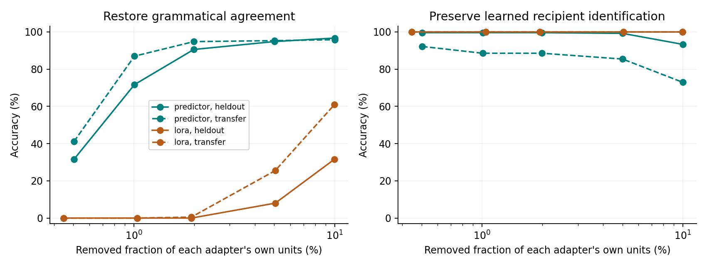
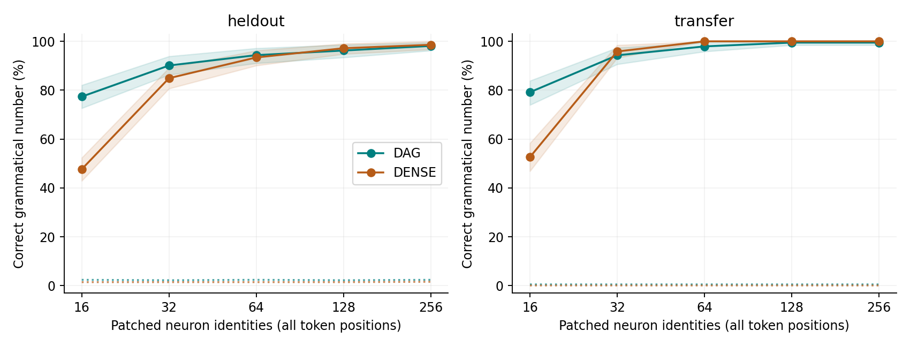
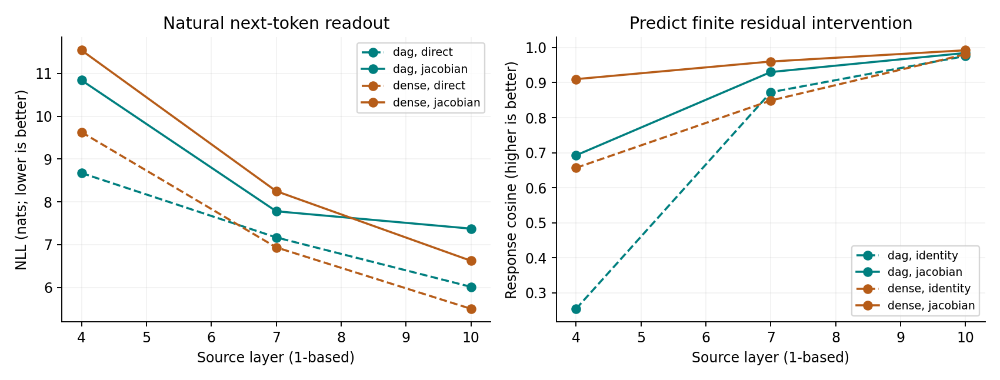

# 三个可解释性方向：局部撤销、神经元回路、J-lens

2026-09-29，按 1 → 2 → 3 的顺序完成。**当前最实用的是 predictor 的局部行为撤销。**
神经元实验发现小预算下的集中性差异；J-lens 能改善部分干预预测，但没有成为可靠的连接语义标签器。
本轮使用原有完整 300M checkpoint，不重新预训练，也没有合并同事的 PR。

## 1. 保留新能力，同时撤销另一项行为变化

在同一个 DAG checkpoint 上，分别训练 predictor-only adapter 和 LoRA，使模型同时：

- 学会根据上下文找收礼物的人。例如 `Alice and Bob ... Alice gave a book to` → `Bob`。
- 刻意学会主谓**不一致**，例如复数主语后偏向单数动词。这是用于审计的坏行为。

原模型本来几乎完全掌握正常主谓一致，因此最初“同时学正确语法和指代”的开发运行只能提高
语法置信度，不能验证两项新增行为的分离。该运行保留在
[agreement_development](adapter_audit/agreement_development/predictor/results.json)，没有进入主结论。
改变任务是在 validation 阶段，主实验的 heldout 和 transfer 当时尚未使用。

训练每步 4 个语法、4 个指代、4 个 WikiText 保留样本，共 600 步。
完整词表交叉熵权重为 0.4 / 0.4 / 0.2；模型选择使用独立 validation，要求保留文本 NLL
不比原模型增加超过 0.15 nats。之后只在另一批 discovery 样本上定位需回退的坐标。

Predictor 的干预为 `alpha_base + gate * (alpha_adapted - alpha_base)`，在加入 local correction
之前执行；local correction 的权重不变，响应仍随当前计算正常产生。一个单位是固定的
layer/head/source/stream 输出坐标，在所有 token 上回退，不是一个参数或一个神经元。

| Predictor 条件 | Heldout 正常语法 | Heldout 指代 | 新词＋新句式正常语法 | 新词＋新句式指代 |
|---|---:|---:|---:|---:|
| 原模型 | 97.64% | 45.67% | 99.48% | 40.62% |
| 微调后 | 0.00% | 100.00% | 0.52% | 93.23% |
| 回退 75 / 3773 坐标（1.99%） | **90.57%** | **99.61%** | **94.79%** | **88.54%** |
| 回退 189 / 3773 坐标（5.01%） | 94.81% | 99.21% | 95.31% | 85.42% |

表中正确答案必须严格高于另一个候选，并列算错。75 坐标的语法准确率 95% 区间为
heldout **[86.79, 94.34]%**、transfer **[91.67, 97.40]%**；指代为
**[98.82, 100.00]%**、**[84.38, 92.71]%**。这些是主谓动词/两个人名的候选选择准确率，
不是通用生成任务的准确率。完整词表 NLL、完整词表 top-1、margin 也保留在原始结果中。

75 坐标回退后的 WikiText NLL 相对微调后变化为 −0.0164 [−0.0483, 0.0185] 和
−0.0077 [−0.0443, 0.0248] nats。这里使用短上下文末 token 抽样，不替代完整普通 eval。

**不是随便改这些层都能做到。** 随机坐标同时匹配 layer、stream、discovery 上系数改变量
RMS 的四分位；三次随机 75 坐标回退的正常语法准确率仅为 heldout 10.85–37.26%、
transfer 14.06–42.19%。普通匹配数量的随机对照和反方向撤销指代的实验也全部保留。
反方向没有达到同样干净的分离，不能据此说任意两个行为都能独立擦除。

LoRA 在相同 backbone 的全部 Q/K/V/O 和 MLP 投影上加 rank-8 更新，训练得到相同的
heldout 行为准确率，transfer 指代甚至达到 100%。回退 13/672 个 rank 项后，正常语法
仍为 heldout 0%、transfer 0.52%；回退 67/672 后为 31.60%、60.94%，指代仍为 100%。
但 predictor 的训练参数是 **30,385,853**，LoRA 是 **2,260,992**，两种回退单位也不等价。
所以本轮支持“存在好用的显式行为控制位置”，不构成参数匹配的 LoRA 可解释性优势结论。

当前回退还需要原 predictor 和微调 predictor 的输出，不能把“75 个坐标”说成“删掉 75 个
adapter 参数”，也没有证明可以只部署一个压缩后的小 adapter。下一步有价值的工程问题是
把这种可选择撤销保留在单个 predictor 中，并换成更实际的微调行为和匹配预算的基线。



横轴是各自可编辑单位的比例，跨方法单位不同；完整预算曲线可避免只看某一个预算。
[汇总 CSV](adapter_metrics.csv)、[Predictor 逐例结果](adapter_audit/predictor/results.json)、
[LoRA 逐例结果](adapter_audit/lora/results.json)。

## 2. 原生 MLP 神经元可以承载稳定的语法干预

恢复使用**未经本轮微调**的 DAG 和 dense。两者都能做主谓一致；原模型指代能力不足，
因此本项不把指代任务用于回路优势结论。

在 `MLP.down_proj` 的输入，即 SwiGLU 后的原生神经元空间，使用 discovery 上的
4 点路径梯度排名：端点 neuron activation 差乘以输入 embedding 插值路径上的平均梯度。DAG 同时插值 backbone 和 predictor 的
输入 embedding，保持完整模型计算。在 heldout 与新词/新句式上做成对替换：

- 必要性：正常输入的选定神经元换成相反主语数的值，检查行为是否被破坏。
- 充分性：相反主语数输入的选定神经元换成正常输入的值，检查正确答案能否恢复。

同一个 neuron identity 在所有位置替换。每种预算有三个匹配 layer 数量的随机对照。
以下是充分性恢复后的正确主谓数选择准确率；没有替换时只有约 0–2%。

| 神经元数 / 共 49152 | DAG heldout | Dense heldout | DAG 新词＋新句式 | Dense 新词＋新句式 |
|---|---:|---:|---:|---:|
| 16 | **77.36%** | 47.64% | **79.17%** | 52.60% |
| 32 | 90.09% | 84.91% | 94.27% | 95.83% |
| 64 | 94.34% | 93.40% | 97.92% | 100.00% |
| 128 | 96.23% | 97.17% | 99.48% | 100.00% |
| 256 | 98.11% | 98.58% | 99.48% | 100.00% |

16 神经元时 DAG − dense 的配对差为 **29.72 [23.57, 36.32]** 个百分点，transfer 为
**26.56 [18.74, 34.38]**。随机 16 神经元几乎没有恢复效果。但扩大到 32–64 后差异明显
缩小，transfer 也没有继续领先。可以说本 checkpoint 的前几个语法神经元更集中，不能说
DAG 在所有任务或所有预算上都更稀疏。这里是路径梯度排名后的结果，也没有证明它是最小回路。



实线为选出的神经元，阴影为成对 bootstrap 95% 区间；虚点线为三个匹配 layer 随机对照的均值。
[所有必要性/充分性预算](neuron_metrics.csv)、[DAG 原始结果](neuron_flow/dag.json)、
[Dense 原始结果](neuron_flow/dense.json)。

进一步寻找会影响这 64 个神经元作用的有效路由，取 discovery 梯度交互最大的边。
删除 4 条边使神经元干预效应减少 heldout 47.1%、transfer 44.5%，但未替换神经元时的
语法准确率也从 97.6% / 99.5% 降至 58.5% / 58.3%。因此它找到了重要的依赖关系，
还不是一种保留原本能力的选择性语义路径解释。所有 4/16/64 边预算及 layer/stream
匹配随机对照均保留，不能只展示“解释掉多少效应”而省略行为损伤。

## 3. J-lens 能预测部分干预，连接语义仍不够可靠

对两模型的零基层 3、6、9，计算完整 **1024 × 1024** 下游 residual Jacobian。
使用 64 条 WikiText train 上下文，每条 32 token，均匀平均所有因果 source/destination
位置对，共 33792 对；每个输出维度实际做 VJP，不使用低秩近似。
这是小校准集的 J-lens 实验，不是原论文 1000 prompt 设置的复现。

通过 post-FF write 注入扰动，干预后的完整 layer state 会被所有后续 DAG 消费者正常使用；
动态 local correction 也保留。读取为 `unembed(norm(J @ h))`，对照直接 logit lens。
在保留测试上下文上，用随机方向、两个扰动幅度和中心差分检查全局矩阵的预测能力。
下面列出 0.05 RMS 扰动下，预测与真实下游响应的平均 cosine：

| 源层（零基） | DAG 直接方向 | DAG Jacobian | Dense 直接方向 | Dense Jacobian |
|---|---:|---:|---:|---:|
| 3 | 0.254 | 0.693 | 0.657 | 0.910 |
| 6 | 0.873 | 0.930 | 0.849 | 0.960 |
| 9 | 0.976 | 0.985 | 0.981 | 0.992 |

这说明矩阵确实学到了下游变换。另一方面，自然文本下一 token 的读出 NLL **变差**：
DAG 在这三层由直接读出的 8.673 / 7.168 / 6.013，变为 10.841 / 7.779 / 7.373 nats；
dense 也变差。对主语数的实际 residual 干预，后两层相关性有所改善，但早层没有稳定效果。
平均 Jacobian 的干预预测有效，不等于读出的词就是可靠语义标签。



还对这三层**全部 21 条 R 来源连接**逐条干预：只把最后 query token 的有效 R 系数设为零，
记录目标层完整 state 的实际变化（包括该层 MLP 响应），再通过 J-lens 预测最终输出变化。
这验证的是对实际局部 state 变化的下游读出，不是仅凭原始消息就预测整个非线性过程。
使用每个预留 split 的前 32 对主谓样本，全部边保留：

| 连接作用预测 | Direct lens | J-lens |
|---|---:|---:|
| Heldout，逐边 Pearson 的均值 | 0.450 | 0.472 |
| Heldout，变化方向正确率 | 57.51% | 57.59% |
| 新词＋新句式，逐边 Pearson 的均值 | 0.539 | 0.549 |
| 新词＋新句式，变化方向正确率 | 61.31% | 63.24% |

这个提升不足以把 J-lens 当作当前项目主要的可解释性优势。
[读出指标 CSV](jacobian_metrics.csv)、[DAG](jacobian_lens/dag.json)、
[Dense](jacobian_lens/dense.json)、[21 条 R 连接的逐例验证和词表读出](jacobian_lens/dag_routes.json)。

## 数据、验证和复现

本轮是受控英文任务的研究实验，不是官方 SVA/IOI benchmark 分数复现。
[固定样本](datasets.json)保存训练、validation、discovery、heldout、transfer，prompt 对不交叉；
transfer 使用未出现在训练任务中的名词、人名和句式。
主谓 heldout 为 106 对、transfer 为 96 对；指代分别为 127、96 对。
候选任务按 pair bootstrap 2000 次。WikiText 按原 train/validation/test split 分开；
validation/test 内按缓存 chunk 奇偶分区，bootstrap 也以缓存 chunk 为组。
原始 JSON 中的 `doc` 字段和 `.../docN` group 是历史命名，实际指 **packed token cache chunk**，
不是原始文章；相邻 chunk 可能属于同一篇文章。

原模型使用 `checkpoints/pr_sync_20260917/{300m-dagformer,300m-baseline}` 的完整 step9000 权重；
DAG 为 FourWay per-head predictor + local correction，原生 SDPA forward，BF16 backbone，
保持 checkpoint 的 norm 配置。Predictor 学习率 3e-5，LoRA 3e-4；AdamW，600 步，seed 20260930。
最后选中的 checkpoint 为 predictor step600、LoRA step400，均由 validation 决定。

完整 adapter 回退与未改模型的最大 logit 差均为 **0**；同输入完整 neuron 重放和零 residual
注入也是 **0**。路由干预的 all-ones gate 与原 neuron 实验的 clean margin 逐例差为 **0**。
LoRA 使用 weight parametrization，覆盖 DAG 直接读取 Q/K/V `.weight` 的路径。
所有模型、LoRA rank、训练步数、掩码、每例分数、随机对照均保留。单个预训练 checkpoint /
训练 seed 的差异不代表跨 seed 稳定性；这些结果也不取代更大模型上的确认。

从仓库根目录运行（顺序与本轮一致；最后的附加对照加强第一项）：

```bash
export CUDA_VISIBLE_DEVICES=3
PY=/scratch/yurenh2/venvs/dagformer-eval-20260917/bin/python
$PY scripts/interp_adapter_audit.py --method predictor --lr 0.00003
$PY scripts/interp_adapter_audit.py --method lora --lr 0.0003
$PY scripts/interp_neuron_flow.py --kind dag
$PY scripts/interp_neuron_flow.py --kind dense
$PY scripts/interp_adapter_controls.py --method predictor
$PY scripts/interp_adapter_controls.py --method lora
$PY scripts/interp_jacobian_lens.py --kind dag
$PY scripts/interp_jacobian_lens.py --kind dense
$PY scripts/interp_jacobian_routes.py
$PY scripts/report_interp_audit.py
```

实际计算使用本机 GPU 3 的剩余资源，设置进程显存上限 65%，未停止其他任务。
模型/adapter/Jacobian 文件在 `/scratch/yurenh2/interp_audit_20260929/`，不放进 Git。
原始结果中的 `git_commit_at_start` 是代码基线；新脚本和本轮结果随本报告同一提交交付。

## 文献对应关系

- [Narrow Finetuning Leaves Clearly Readable Traces in Activation Differences](https://arxiv.org/abs/2510.13900)：
  第一项借鉴窄微调留下可审计行为差异的方向，使用的是显式 routing 输出回退，不是 ADL 复现。
- [Sparse Model Diffing via Dynamic Circuits 官方代码](https://github.com/Siriuslala/circuit-tuning)：
  主谓不一致作为受控行为变化的任务参考；本轮是自建句式，没有引用该工作的 benchmark 数字。
- [Language Model Circuits Are Sparse in Neuron Basis](https://arxiv.org/abs/2601.22594)：
  第二项使用相同类型的原生 pre-down-projection neuron 空间，但归因方法是本轮路径梯度启发式，未复现 RelP。
- [How Much Do Circuits Tell Us?](https://arxiv.org/abs/2605.08348v2)：
  对回路解释区分必要性/充分性、跨输入稳定性与特异性，避免只看消融损伤。
- [Verbalizable Representations Form a Global Workspace](https://arxiv.org/abs/2607.15495)：
  第三项使用平均下游 Jacobian 的读出思路。应用到 DAG 不自动构成新方法，且本轮未复现其完整设置。

可以直接比较一个输入在原模型、微调后和局部回退后的选择概率：

```bash
$PY scripts/demo_predictor_rollback.py \
  --prompt 'The pilots near the doctor' --choices is are
$PY scripts/demo_predictor_rollback.py \
  --prompt 'When Alice and Bob went to the park, Alice gave a book to' --choices Alice Bob
```

默认使用上述 75 坐标 mask；`--adapter` 可指定解压后的 predictor 权重。
输出同时包括候选内概率与完整词表 log-probability。

Delta 的小文件副本在：
`/u/yurenh2/dagformer-20260917/experiments/results/interp_audit_20260929/README.md`。
包含结果、脚本、两个 adapter 和两组 Jacobian 矩阵的单文件分享包在：
`/work/hdd/biro/yurenh2/interp_audit_20260929.tar.gz`。
解压后 adapter/matrix 位于包的根目录，脚本和结果保留仓库相对路径。
Biro HDD 只新增这一个大文件；代码与展开的结果放在 home。
