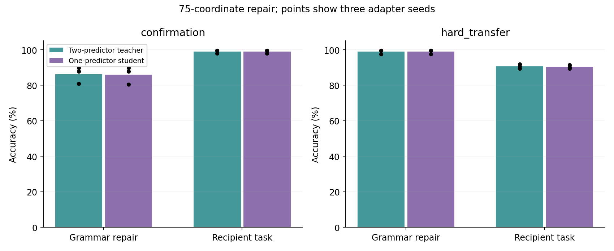
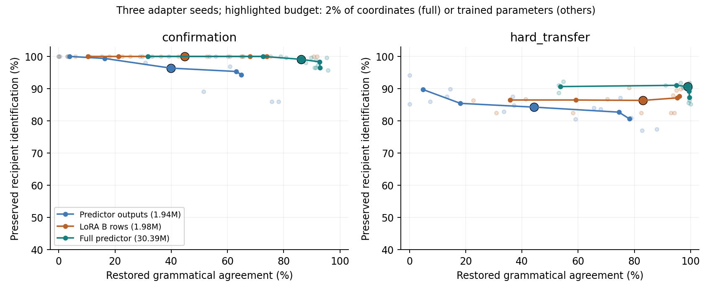

# Predictor 行为回滚：三 seed、LoRA 行编辑与单 predictor 部署

本轮延续 [上一轮第一项实验](../interp_audit_20260929/README.md)：同时微调模型学会主谓不一致和正确的收件人识别（IOI），再局部撤销前一种行为，保留后一种。使用同一个 300M DAGFormer step9000 checkpoint、完整模型前向和动态 correction。step9000 是所用检查点，不代表配置中的 12000 步预训练已经跑满。

**主要进展是：75 个 routing 输出位置的回滚在三次 adapter 训练中复现，并能拟合成只运行一次 predictor 的小修复补丁。** 新增同分布测试上，单 predictor 的语法正确率为 86.07%，IOI 为 99.09%；新词汇和长句式上为 98.96% / 90.36%。更强的 LoRA 行编辑也能选择性修复行为，因此这轮支持一个可部署的干预接口，还不能支持 DAGFormer 特有的可解释性优势。

完整数字在 [summary.json](summary.json) 和 [metrics.csv](metrics.csv)，逐例预测、全部预算、反向任务 mask、随机对照保存在 `runs/*/*.json.gz`。三组 seed 为 20260930、20261001、20261002；均是 **adapter 训练 seed**，共享同一个预训练模型。

## 1. 三组完整 predictor 的结果

先看未编辑状态，避免把恢复旧能力和保留新能力混在一起：

| 状态（三 seed 均值） | confirmation 语法 | confirmation IOI | 新长句式语法 | 新长句式 IOI |
|---|---:|---:|---:|---:|
| 原始模型 | 97.66% | 49.22% | 100.00% | 57.42% |
| 完整 predictor 微调后 | 0.00% | 100.00% | 0.65% | 90.76% |
| 75 坐标功能回滚，双 predictor | 86.20% | 99.09% | 98.96% | 90.63% |
| 75 行修复补丁，单 predictor | 86.07% | 99.09% | 98.96% | 90.36% |

语法准确率计算为正确候选的 logit 严格高于错误候选，平分算错。数据内部的 SVA target 已交换为错误语法，所以汇总使用 `margin < 0`。IOI 同样是在两个候选之间比较；这些数字不是开放生成准确率。训练、定位和模型选择使用完整词表 NLL。

| seed | 双 predictor：confirmation 语法 / IOI | 单 predictor：confirmation 语法 / IOI |
|---|---:|---:|
| 20260930 | 89.84% / 99.61% | 89.84% / 99.61% |
| 20261001 | 87.89% / 98.05% | 87.89% / 98.05% |
| 20261002 | 80.86% / 99.61% | 80.47% / 99.61% |



图中的点表示三组 adapter seed，柱为均值。小样本 seed 范围描述重复训练的波动，不是不同预训练模型的置信区间。

## 2. 这些位置是否具有选择性和稳定性

比较同一批完整 predictor adapter，主预算固定为 75/3773 个输出坐标。匹配随机对照同时保持 layer/stream 分布和 discovery 上 coefficient-change RMS 四分位分布，每个 seed 三次抽样。

| 编辑方式（三 seed 均值） | confirmation 语法 / IOI | 新长句式语法 / IOI |
|---|---:|---:|
| 定位得到的 75 坐标 | 86.20% / 99.09% | 98.96% / 90.63% |
| 匹配随机 75 坐标 | 18.01% / 99.87% | 27.43% / 89.54% |
| discovery 目标最优的整体缩放 | 74.74% / 89.97% | 96.61% / 79.17% |
| discovery 语法准确率最接近的整体缩放 | 82.03% / 86.59% | 98.05% / 76.69% |

整体缩放在 13 个预定强度中选择：`0,.05,.1,.2,.3,.4,.5,.6,.7,.8,.9,.95,1`，选择过程只看 discovery。最后一行仅在 discovery 上近似匹配语法程度，不能理解成在测试集上精确匹配。局部回滚在本任务中比整体撤销微调更能保留 IOI。

把 seed 20260930 找到的 **同一组 75 个位置原样用于另外两个 seed**，不重新定位，confirmation 得到平均 **87.70% 语法 / 99.02% IOI**，新长句式为 **99.02% / 90.43%**。这两次真正的迁移不含源 seed 本身。各自重新定位的集合与源集合 Jaccard 分别为 **0.724、0.807**。

这些证据说明，同一预训练检查点上，某组 routing 输出位置可以作为相对稳定的行为干预位置。尚未测试不同预训练 seed、自然指令微调、开放生成任务，或逐边的自然语言语义解释。

## 3. 更公平的参数量与更强的 LoRA 对照

| 微调方法 | 训练参数 | 主编辑预算 | confirmation 语法 / IOI | 新长句式语法 / IOI |
|---|---:|---|---:|---:|
| 完整 predictor | 30,385,853 | 75 个 routing 输出坐标 | 86.20% / 99.09% | 98.96% / 90.63% |
| 仅 predictor 输出层 | 1,935,549 | 75 行，38,475 个参数 | 39.84% / 96.35% | 44.27% / 84.24% |
| LoRA rank7，B 输出行编辑 | 1,978,368 | 5,652 行，39,564 个参数 | 44.79% / 100.00% | 83.07% / 86.33% |

后两项训练参数只差约 2.2%，编辑预算均约为训练参数的 2%。完整 predictor 一行代表一个函数输出坐标；其 encoder/trunk 也经过微调，功能回滚不能算作只重置了相同比例的训练参数。此行的训练参数约为 LoRA 的 15 倍。

**冻结 predictor encoder/trunk、只训练输出层并没有保住原来的强回滚效果。** LoRA 行编辑的结果也有明显 seed 波动：confirmation 语法正确率为 75.39%、22.66%、36.33%。在 5% 编辑预算下，输出层方法得到 63.15% / 95.31%，LoRA 得到 68.10% / 100.00%。全部 0.5%、1%、2%、5%、10% 预算都在结果文件中。



曲线为三 seed 均值，浅色点为各 seed，黑边点是主预算。完整 predictor 用输出坐标比例，另外两项用被重置的训练参数比例；图不能作为统一 circuit size 的比较。

还有一项重要修正：拿上一轮 **完全相同的 rank8 LoRA 权重**，只更换编辑粒度，结果如下。

| LoRA 编辑方式 | 原 heldout 语法 / IOI | 原 transfer 语法 / IOI |
|---|---:|---:|
| 旧方法：67 个 rank 项，约 10% rank 单元 | 31.60% / 100.00% | 60.94% / 100.00% |
| B 行：约 2% 训练参数 | 66.98% / 100.00% | 91.15% / 100.00% |
| B 行：约 5% 训练参数 | 87.26% / 100.00% | 96.88% / 100.00% |

权重没变，行编辑显著改善了选择性。两种编辑的预算单位不同；这个实验能说明旧 rank 对照偏弱，不能据此声称行编辑用了相同的 circuit 数量。基于上一轮 rank-only 对照判断 predictor 明显优于 LoRA，需要收回。

## 4. 单 predictor 补丁怎样得到

原来的功能回滚同时计算原 predictor P0 和微调后 P1：被选中的位置使用 P0 输出，其他位置使用 P1 输出。

现在保持 P1 的 encoder/trunk 和未选中输出行冻结。在原训练输入上，利用 P1 的 512 维 trunk 表征加 bias，拟合选中位置的 `P0(x) - P1(x)`。得到的线性修正写入这些输出行，推理时只执行一次修改后的 P1。

拟合使用 768 个 SVA、768 个 IOI 和 2048 个自然文本训练输入；任务权重为 0.4/0.4/0.2，任务内等权分配到输入，再等权分配到有效 token 位置。四个 ridge 强度 `1e-5,1e-3,.1,10` 由原 validation 上对双 predictor teacher 的完整词表 KL 选择。之后也尝试了 200 步仅更新选中行的 KL 优化，候选包括第 0、50、100、150、200 步。

**三 seed、两种预算全部选择第 0 步，也就是 ridge 拟合已经最好。** 不能把最终结果归功于后续梯度微调。这个转换方案是在看到输出层微调较弱后追加的探索；未用测试结果选择 ridge、checkpoint 或 mask。

| seed | 75 行 ridge | validation teacher KL（nats） | teacher 延时 | 单 predictor 延时 |
|---|---:|---:|---:|---:|
| 20260930 | 1e-5 | 0.00016882 | 30.63 ms | 28.04 ms |
| 20261001 | 1e-3 | 0.00015243 | 30.52 ms | 28.00 ms |
| 20261002 | 1e-5 | 0.00016294 | 30.52 ms | 27.95 ms |

延时是共享 A6000 上 16×96 token 的固定 batch、30 次 CUDA-event 测量的中位数，只投影最后一个位置的词表 logits。这个测量不能代表通用训练或生成吞吐。

75 行补丁包含 **38,475 个参数，文件 156,043 bytes（约 156 KB）**；189 行为 96,957 个参数、390,482 bytes。补丁保存的是这些行的替代值，需要叠加在对应 seed 的 **约 122 MB / 116 MiB 完整 predictor adapter** 上，并保留原 backbone。156 KB 不是完整微调模型的总存储量。

同分布自然文本的 NLL 从 teacher 的 3.83257 变成 3.83398；新长上下文从 3.86346 变成 3.86620。这里是测试缓存抽取的下一 token NLL，不能与整套 WikiText 的滑窗 PPL 混用。

输出层微调和 LoRA 行编辑还另外导出了精确参数回滚版本：两种预算、三 seed 均在五批输入上验证了参数落地前后 logits 最大误差为 0，每次前向只调用一次 predictor。完整 predictor 的拟合补丁是近似转换，效果和 KL 如上，不具有这个精确相等保证。

## 5. 数据、训练与复现

新增测试在本轮评估前生成并锁定：`confirmation` 和 `hard_transfer` 各 128 对 SVA、128 对 IOI、128 个 WikiText 窗口。前者复用训练模板分布，后者使用训练外词汇和每任务六个新长模板；与既有任务 split 不重复精确 prompt。`hard_transfer` 是命名，句子更长不保证所有子任务都更难。

原 train / validation / discovery 不变。实际 train 为 768 / 768 / 4096 个 SVA / IOI / retain 输入；validation 为 74 / 96 / 128；discovery 为 106 / 122 / 128。新自然文本窗口和旧测试使用同一 test cache，可能重叠；它们不是新的独立语料。retain 的 `doc` 字段表示 packed cache chunk，不表示原始文章，bootstrap 也按 chunk 分组。

每个方法训练 600 步，每步每任务 4 个输入；AdamW、weight decay 0.01、30 步 warmup、梯度裁剪 1。完整 predictor lr3e-5；LoRA lr3e-4；输出层在第一个 seed 的原 validation 上比较 lr3e-4 与 1e-3，选中 1e-3 后锁定。候选 checkpoint 每 100 步评估，需满足 retain validation NLL 不比原模型差超过 0.15 nats，再按平均 SVA/IOI NLL 选取。

定位沿四个插值点 `.25,.5,.75,1` 累积 gate 梯度，并在 discovery 上选择其他任务损伤惩罚 `0,1,4`。所有测试均在选择后评估。每组结果包含按反事实 pair 分组的 2000 次 bootstrap 区间；跨 seed 汇总报告均值、标准差、最小值、最大值。随机控制的跨 seed 汇总先平均每个 seed 的三次随机抽样。

本机权重目录：`/scratch/yurenh2/interp_followup_20260929/runs/<方法>_s<seed>/weights/`。模型和 tokenizer 位于 `checkpoints/pr_sync_20260917/`。在仓库根目录可直接运行已保存的单 predictor 修复：

```bash
PY=/scratch/yurenh2/venvs/dagformer-eval-20260917/bin/python
REPAIR_WEIGHTS=/scratch/yurenh2/interp_followup_20260929/runs/full_s20260930/weights
CUDA_VISIBLE_DEVICES=3 "$PY" scripts/demo_predictor_rollback.py \
  --single --adapter "$REPAIR_WEIGHTS/predictor_best.pt" \
  --row-patch "$REPAIR_WEIGHTS/compiled_sva_75_patch.pt" \
  --prompt 'The pilots near the doctor' --choices is are
```

该命令已经实际重载导出权重验证：一次 predictor 调用，选择 `are`，候选内概率 0.66541。也支持 `--model-path` 和 `--tokenizer` 指定另一台机器上的原检查点及 tokenizer。

主实验的底层命令示例（在新输出目录复现一组）：

```bash
CUDA_VISIBLE_DEVICES=3 "$PY" scripts/interp_adapter_audit.py \
  --method predictor --predictor-scope all --seed 20261001 --lr 3e-5 \
  --out /scratch/yurenh2/reproduce_full_s20261001 \
  --weights /scratch/yurenh2/reproduce_full_s20261001/weights \
  --extra-tests experiments/results/interp_followup_20260929/extra_tests.json.gz \
  --test-splits heldout transfer confirmation hard_transfer
```

输出层改为 `--predictor-scope outputs --lr 1e-3 --budget-unit trainable_fraction`；LoRA 改为 `--method lora --rank 7 --lr 3e-4 --lora-unit row --budget-unit trainable_fraction`。其他选项保持相同。

`run_interp_followup.py` 记录本轮顺序运行和首 seed 复用流程，需要已存在的两项 validation 试跑以及上一轮权重；`finish_interp_followup.py` 补充对照和转换。它们使用本机 scratch 路径。`report_interp_followup.py` 只读已归档结果生成汇总和两张图。

Delta 的结果副本：
`/u/yurenh2/dagformer-20260917/experiments/results/interp_followup_20260929/README.md`

包含结果、所用脚本和全部导出 adapter/patch 的单文件分享包：
`/work/hdd/biro/yurenh2/interp_followup_20260929.tar.gz`

解压后结果与脚本保留仓库相对路径，权重位于 `weights/<方法>_s<seed>/`。包内不重复放原 300M backbone；需要匹配的 step9000 检查点。代码和展开的结果存 home，Biro HDD 只增加这个归档文件。
