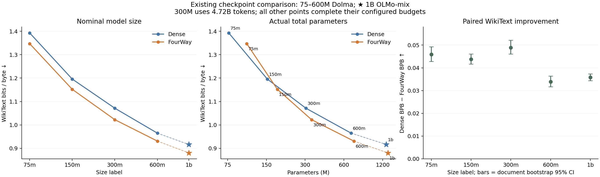

# Xiaocong 新结果、scaling 与 PR #3 审查

2026-09-28，PR head `88d472b`，审查基于 main `a6703d6`。读取了 timan1
实际 checkpoint、尚未 push 的 150M eval、新 75M/150M 共40个剪枝结果，以及
Delta 最新完成的600M 12B-token eval。没有修改同事的文件或合并 PR。

## 结论

**已有 FourWay 的收益得到复现；新 modular 是有取舍的架构，尚未全面优于
FourWay。Scaling 可以展示收益延续到1B，目前不宜主张更优的 scaling exponent。**

### 新75M/150M

WikiText word PPL，越低越好：

| 规模 | 旧 dense | 新 dense | 旧 FourWay corrected | 新 FourWay corrected | 新 modular |
|---|---:|---:|---:|---:|---:|
| 75M | 174.80 | 174.59 | 147.47 | 141.30 | 138.25 |
| 150M | 84.16 | 81.35 | 71.55 | 69.41 | 72.39 |

新150M的 corrected 在 LAMBADA、SciQ、0/30/50/70% head+neuron pruning 上
也优于 modular。Modular 的优势更集中在75M高稀疏度、以及部分整块剪枝设置。
它没有 local correction，来源也改为 attention/MLP 模块输出；不能当作只将
旧架构一个开关从 fixed 改成 predictable 的消融。

一个明显变化是75M整块剪掉50%：旧 corrected 的 domain NLL 是3.4520，
新同架构 corrected 已变为2.7755，新 modular 为2.6198。因此旧实验的崩塌
对重新训练和剪枝轨迹敏感，不能把全部改善归于 modular。

新旧普通评估的公开任务、任务版本与样本数对齐；新训练预算多0.78125%，
训练语料重新构建，不能确认新旧逐token完全相同。SciQ 还须区分 `acc` 和
`acc_norm`。这些是跨run比较的实际差别，尚未分离每项的因果贡献。

新三族结果为 dense / corrected / modular；modular 不是 MUDDFormer。本次
核对的40个新剪枝run不包含MUDDFormer，不能由这些表验证对其优势的转述。
PR另有旧streamed 150M三方剪枝结果，DAG在该组优于dense和MUDDFormer；
具体数值及checkpoint分组见下方详表的补充部分。

详表和原始数据：[new_small_models.md](new_small_models.md)、
[new_small_models.json](new_small_models.json)。

实际训练池为21.16% Books、78.84% C4；新旧预训练eval cache的inputs与
labels逐元素一致。历史上移图画的是train NLL，不能据此归因于更换OOD eval。
数据来源、缓存比较和图中loss字段见 [eval_settings.md](eval_settings.md)。

### Scaling

配对训练预算下，WikiText PPL：

| 名义规模 | Dense | FourWay | 相对下降 |
|---|---:|---:|---:|
| 75M | 174.80 | 147.47 | 15.63% |
| 150M | 84.16 | 71.55 | 14.98% |
| 300M | 53.05 | 44.25 | 16.58% |
| 600M | 35.74 | 31.52 | 11.80% |
| 1B | 29.86 | 26.15 | 12.43% |

小尺寸到大尺寸的优势略收窄，但没有消失。每一对的 WikiText BPB 改善的
文档bootstrap区间均大于零；这不包含训练seed不确定性，也不表示所有任务
都领先。新600M的LAMBADA提高4.60个百分点、HellaSwag提高2.36个百分点，
BoolQ则降低4.28个百分点。

当前斜率对横轴定义敏感：按名义规模拟合，五点 BPB 对 log2(size) 的斜率
为dense −0.12596、DAG −0.12280；改用实际总参数后，分别为−0.11507、
−0.12334，排序反过来。75M额外predictor/correction参数占比大，不能将
名义backbone规模当总参数数目。

此外，300M双方只到step9000、4.719B tokens，并未补足6.3B；1B使用
OLMo-mix，75M–600M使用Dolma且历史数据流程不完全相同。它们支持跨尺寸的
成对验证，不构成严格统一20 tokens/实际总参数的compute-optimal scaling law。
要增强这条证据，最直接的缺口是完成300M DAG至step12000并评估已有dense
step12000；这仍只补名义预算缺口，不会自动消除数据和总参数口径差异。

曲线、拟合与来源：[scaling/](scaling/)。关于实际FLOPs以及用户提到的
ICLR2026 EBT 对照：[compute_and_ebt_notes.md](compute_and_ebt_notes.md)。

换为 `word NLL = ln(word-PPL)` 后，五个尺寸的NLL相对改善为3.3–4.6%。
固定loss floor为0的log–log拟合指数为dense 0.1611、FourWay 0.1629，
两条曲线大体平行；这一拟合与上面的BPB对log(size)直线拟合形式不同。
转换数值、两种拟合及图见 [NLL scaling](scaling/nll_scaling.md)。

### 合并建议

**先小修，再整体合入。** 普通 eval 和 output-mask 剪枝 NLL 可以保留。
PR当前目标还是 `interp/routing-circuit-power`，真正合入main时需相应调整基线。
当前实现还需处理：

1. Modular 的 R 输出不参与前向，却计入 column importance 和稀疏统计。
2. Head 参数计数忽略跨head Q/K norm；V norm开启时V也耦合，导致参数横轴
   和可压缩率虚计。
3. 已提交的绘图脚本识别不了新 dense/fourway/modular family，无法按说明重画。

Loader 的合并冲突和自动合并引入的 `cfg` 未定义已在隔离目录修成预览，
45项相关测试通过。预览没有改变main，也没有修复上述三项科学/工具问题。
[合并审查](merge_readiness.md)解释影响范围，
[integration_preview.patch](integration_preview.patch)保留可审阅的loader集成方案。

### 对研究叙述的建议

可组合的证据是：跨尺度语言建模收益、在明确剪枝协议下保留能力，以及解释
这些收益依赖的连接/局部计算。已有旧模型的 freeze-predictor 对照几乎不影响
剪枝恢复，因此不能直接把鲁棒性归因为 global predictor 的自适应改道。
下一项最有辨别力的分析是在新模型上分开冻结 global predictor、local
correction 与 backbone，比较相同损伤后的恢复；modular还需补它自己的
predictor冻结对照。这里是后续建议，本次没有提交这些训练。
