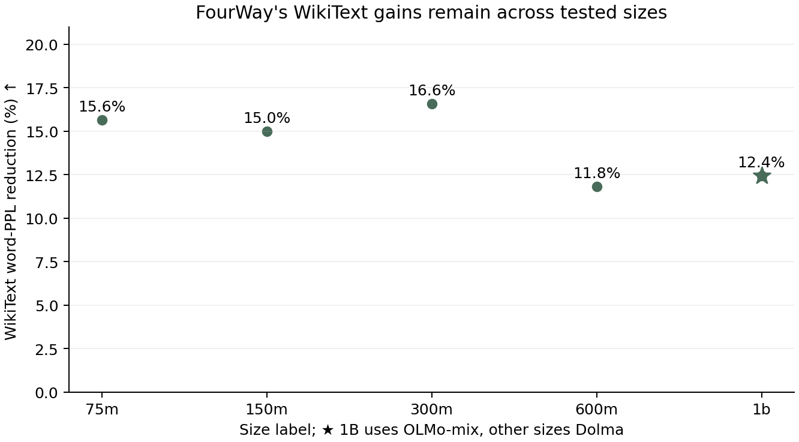

# Existing-checkpoint scaling audit — 2026-09-28

现有结果支持 **FourWay 的收益能保持到最大已测试尺寸**。WikiText word-PPL
在五个尺寸上降低约 12–17%；“小尺寸优势特别大，放大后优势消失”与这组数据不符。
当前数据还不能支持更好的 scaling exponent，也不是已经齐备的严格 Chinchilla scaling law。
本报告只分析已完成的 paired evaluation；没有训练新模型，也没有混入 Xiaocong 新的 75M/150M 系列。

| 标称尺寸 | 两侧实际训练 tokens, B | Dense / FourWay 总参数, M | WikiText word-PPL, Dense / FourWay | PPL 降低 |
|---|---:|---:|---:|---:|
| 75M | 1.572864 | 76.56 / 105.66 | 174.80 / 147.47 | 15.63% |
| 150M | 3.145728 | 152.59 / 182.56 | 84.16 / 71.55 | 14.98% |
| 300M | 4.719116 | 304.14 / 336.45 | 53.05 / 44.25 | 16.58% |
| 600M | 12.006195 | 682.71 / 717.00 | 35.74 / 31.52 | 11.80% |
| 1B | 20.006830 | 1279.40 / 1316.05 | 29.86 / 26.15 | 12.43% |

WikiText BPB 改善依次是 0.04587、0.04379、0.04892、0.03388、0.03582；
每个尺寸的文档配对 bootstrap 95% CI 均高于零。置信区间是固定 checkpoint
的评测样本不确定性，不是多训练 seed 的不确定性。word-PPL 直接取 harness
原始结果；PPL相对改善图只展示点估计，配对置信区间在BPB图中展示。
这里使用word-PPL，不是token-PPL。

600M 使用 **9 月 25 日完成评测的 12.006B 续训终点**，不是仓库旧
`scaling_eval_20260917/standard_600m` 中的 7.34B 中间结果，也不是
`standard_matched` 中孤立的另一份 600M dense checkpoint。

## 斜率是否变差

以下只是 OLS 拟合 `WikiText BPB = a + b × log2(parameters)` 的描述性诊断。
`b` 越负表示每翻倍参数下降更多；未拟合不可约 loss floor，也未把这几个点当作
受控 power-law 实验。换为 `log(word-PPL)` 是同一组 WikiText loss 的线性缩放，
不会提供独立证据。

| 数据 / 横轴 | Dense b | FourWay b |
|---|---:|---:|
| 75–300M，标称参数 | −0.16085 | −0.16238 |
| 75–600M，标称参数 | −0.14094 | −0.13785 |
| 75M–1B，标称参数 | −0.12596 | −0.12280 |
| 75M–1B，各模型真实总参数 | −0.11507 | −0.12334 |

五点标称轴上 FourWay 的斜率绝对值只小约 2.5%，两条曲线相近；
用真实总参数作横轴时，斜率排序反过来了。额外 predictor / correction
约 29–37M 参数，对 75M 的相对增幅远大于对 1B 的增幅。
因此现在最稳妥的论点是 **跨尺寸保持较低 held-out loss**，不是“scaling slope 更好”。
每个表中 paired 比较也是相同 backbone 尺寸和 token 预算的比较，
不能直接当作相同总参数或相同训练 FLOPs 的效率证明。

## 下游任务的趋势

下表全部是 FourWay − dense 的百分点差值；HellaSwag 使用 normalized accuracy，
其余三项使用 accuracy。完整 14 项结果和每项 CI 在
[paired_task_metrics.csv](scaling/paired_task_metrics.csv)。

| 尺寸 | LAMBADA | HellaSwag | SciQ | BoolQ |
|---|---:|---:|---:|---:|
| 75M | +3.57 | +0.40 | +5.10 | +4.53 |
| 150M | +5.74 | +1.04 | +5.00 | +9.76 |
| 300M | +4.64 | +1.63 | +5.90 | +4.53 |
| 600M | +4.60 | +2.36 | +3.50 | −4.28 |
| 1B | +5.01 | +3.78 | +2.20 | −7.49 |

HellaSwag 的点估计增益随尺寸增加，LAMBADA 保持约 4–6 个百分点的增益，
并没有出现所有任务的优势一起收窄。另一方面，最新 600M 的 BoolQ 已经下降，
与 1B 同方向；600M 的 paired CI 为 [−6.18, −2.39] pp，1B 为
[−9.85, −5.08] pp。因此不能概括成所有下游能力都随规模持续获益。

## 预算与数据口径

75M、150M、300M 使用 Dolma mmap；600M 是 Dolma streaming 历史训练再续训，
1B 使用 OLMo-mix。各模型 ordinary eval 使用相同任务定义、tokenizer、1024 context、
FP32 softmax、few-shot seed 1234 和 `lm_eval 0.4.13`。600M 与 1B 的
continuation 完成状态来自 optimizer update counts，而不是依据配置文件推断。

目前最具体的缺口是 **300M 完整预算的配对评测**：当前两侧评测 checkpoint
均为 step9000，对应 9001 updates / 4.719116288B tokens；配置写 12000
并不等于评到了完整训练。Delta 原始目录有 dense `checkpoint_step12000.pt`
（本轮只验证文件存在，未重新读取 optimizer），FourWay 仅找到 step9000 / step10500。
FourWay step10500 对应 5.505548288B，仍未满预算。可先续完该 FourWay 到
12000 updates，再对最终 dense/FourWay 做同口径评测。

此外，“20 tokens / parameter”目前是围绕标称模型大小的预算意图；按当前
**真实总参数**计算，dense/FourWay 的 tokens per parameter 分别为：
75M 20.54/14.89，150M 20.62/17.23，300M 15.52/14.03，
600M 17.59/16.74，1B 15.64/15.20。若要用完整五点拟合严格 scaling law，
还需要统一预训练语料、参数预算定义和训练 recipe；目前 1B 不宜直接并入同一个
Dolma 曲线作为同分布采样。实际 FLOPs 另见
[compute_and_ebt_notes.md](compute_and_ebt_notes.md)。

## 来源与复现

- [model_metrics.csv](scaling/model_metrics.csv)：每个 checkpoint 的参数、token 预算、原始 BPB/PPL、代码 revision 和结果路径。
- [descriptive_fits.json](scaling/descriptive_fits.json)：所有预先列出的子集及两种横轴的诊断拟合。
- [Delta 600M 完整预算结果](scaling/provenance/standard_600m/paired_summary.md)：本轮从 `/u/yurenh2/dagformer-20260917/results/completed_scaling/standard_600m` 原样取回的小 JSON / Markdown 文件。
- [75–300M 配对结果](../results/eval_20260917/standard_matched/paired_summary.json)；[旧模型实际训练预算](../results/eval_20260917/provenance/training_budgets.json)。
- [1B 配对结果](../results/completed_scaling_20260917/standard_1b/paired_summary.json)；[600M / 1B 完成证明](../pretraining_handoff_20260928/manifest.json)。

运行 `python experiments/review_xiaocong_20260928/scaling/analyze_scaling.py`
可重新生成 CSV、拟合 JSON 及 PNG/PDF 图，不需要 GPU、checkpoint 权重或网络。
