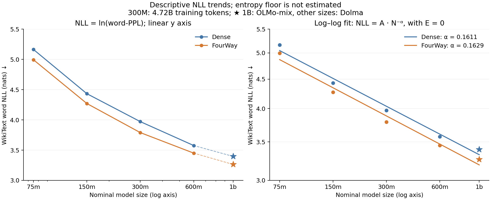

# WikiText NLL scaling — 2026-09-28

换成 NLL 后，两条曲线依然很接近，FourWay 在五个尺寸都较低。
如果拟合无常数项的 `NLL = A × N^(-α)`，标称参数轴上的 α 为
**dense 0.1611、FourWay 0.1629**。FourWay 的点估计略陡，但差异只有
0.00175；现有数据不足以支持更好的 scaling exponent。

这里转换的是原始 harness 的 **word-PPL**：`word NLL = ln(word-PPL)`，
单位是 nats/word。它不是 tokenizer 的每 token NLL；不要与独立窗口评测的
token NLL 或预训练 minibatch loss 直接对比。

| 标称尺寸 | Dense word NLL | FourWay word NLL | NLL 降低 | NLL 相对降低 |
|---|---:|---:|---:|---:|
| 75M | 5.16362 | 4.99362 | 0.17000 | 3.29% |
| 150M | 4.43267 | 4.27037 | 0.16231 | 3.66% |
| 300M | 3.97122 | 3.78990 | 0.18132 | 4.57% |
| 600M | 3.57614 | 3.45055 | 0.12559 | 3.51% |
| 1B | 3.39664 | 3.26388 | 0.13276 | 3.91% |

NLL 的相对改善约为 3.3–4.6%，没有随尺寸单调收窄。PPL 是 NLL 的指数，
所以此前约 12–17% 的 PPL 改善与这些 NLL 数值一致，不是不同的实验结果。

## 两种拟合需要区分

| 拟合形式，标称参数轴 | Dense | FourWay | 含义 |
|---|---:|---:|---|
| `NLL = a + b × log2(N)` | b = −0.46687 | b = −0.45515 | 每翻倍参数下降的绝对 NLL；FourWay 点估计略平 |
| `NLL = A × N^(-α)`，固定 E=0 | α = 0.16112 | α = 0.16286 | NLL 的相对下降幂率；FourWay 点估计略陡 |

第一种就是把 `ln(PPL)` 对 `log(parameters)` 作直线拟合。
第二种则要把 `ln(NLL) = ln(ln(PPL))` 对 `ln(parameters)` 作直线拟合。
两种模型的目标不同，斜率排序不必相同，不能把第一种的 b 当作第二种的 α。

标准带常数项的形式是 `NLL = E + A × N^(-α)`。本次只报告固定 **E=0**
的描述性结果，没有估计不可约 entropy/loss floor，因此 α 不是扣除 floor 后的
可靠 scaling-law 指数。图中五个点仍混有 300M 的中间预算和 1B 的语料变化。

真实总参数轴上的 E=0 拟合为 dense α=0.14758、FourWay α=0.16440。
额外 predictor 参数占比随模型变大而下降，导致两类横轴给出不同斜率；
这个结果保留作敏感性检查，不能据此声称等参数或等 FLOPs 效率优势。

## 与 BPB 及既有 scaling 分析的关系

同一份 WikiText 的 byte/word 计数固定，因此

`word NLL = BPB × ln(2) × bytes/words = BPB × 3.7065703337`。

脚本核验十个模型结果均满足相同常数。这意味着 NLL 对比与 BPB 对比包含
相同信息；对 BPB 做相同的 E=0 log–log 拟合，会得到完全相同的 α。
PPL→NLL 更接近常用 loss 展示口径，但不能解决既有训练设计的不一致。

当前 300M 两侧只有 4.719B tokens 的配对普通 eval，未满配置的 12000
updates；75–600M 使用 Dolma，1B 使用 OLMo-mix。完整预算与来源审计见
[scaling.md](../scaling.md)。目前仍适合表述为：**模型放大后保留了较低的
held-out loss，两条描述性 scaling 曲线大体平行。**

## 复现

运行 `python experiments/review_xiaocong_20260928/scaling/nll_scaling.py`。
脚本只读取已提交的 [model_metrics.csv](model_metrics.csv)，不加载模型、不训练。

- [nll_scaling.csv](nll_scaling.csv)：五个尺寸的原始 NLL 与改善量。
- [nll_scaling.json](nll_scaling.json)：两个参数横轴、两种拟合、所有未舍入数值和口径说明。
- [nll_scaling.pdf](nll_scaling.pdf)：独立矢量图。
